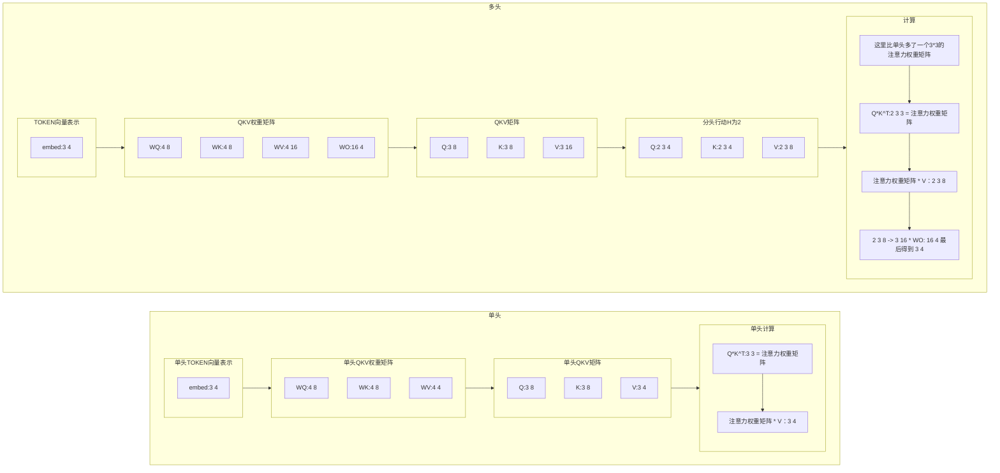

## 前言

论文链接：https://arxiv.org/abs/1706.03762

> 这篇有些地方读起来应该是奇奇怪怪的，是因为有些名词自己译的 :(
>
> `dominant`：占主导地位的
>
> `transduction`：转导，转换
>
> `firmly`：坚定地，坚决地，坚固地
>
> `identical`：完全相同的
>
> `facilitate`：促进；使便利；促使
>
> `consists`：包含
>
> `compatibility`：兼容性；相容性；相容；并存；和睦相处
>
> `counteract`：抵消，抵消

## 圣图


## 编码器（Encoder）

$N=6$

由6个相同的层（`layer`）组成，每层包含两个子层。

子层：

1. 多头注意力机制（`multi-head self-attention mechanism`）
2. 位置相关的全连接前馈网络层（`position-wise fully connected feed-forward network`）

两个子层周围都使用了残差连接（`residual connection`）随后进行了层归一化（`layer normalization`）

每个子层的输出是$LayerNorm(x+Sublayer(x))$，$Sublayer(x)$是子层本身实现的函数。

为了便于残差连接，模型所有子层和嵌入层（`embedding layer`）都产出$d_{model}=512$维度的输出。

## 解码器（Decoder）

解码器同样由6个相同的层组成，包含三个子层。

子层：

1. 掩码多头注意力机制（`masking multi-head self-attention mechanism`）
2. 对编码器的输出执行多头注意力机制（`multi-head self-attention mechanism`）
3. 位置相关的全连接前馈网络层（`position-wise fully connected feed-forward network`）

## 注意力（Attention）

> An attention function can be described as mapping a query and a set of key-value pairs to an output, where the query, keys, values, and output are all vectors. The output is computed as a weighted sum of the values, where the weight assigned to each value is computed by a compatibility function of the query with the corresponding key.
>
> 注意力函数可以被描述成将查询和一组键值对映射到输出，其中查询、键、值和输出都是向量。输出是值的加权和，其中分配给每个值的权重是通过查询与相应的键的兼容性函数计算的。

### 缩放点积注意力（Scaled Dot-Product Attention）


> The input consists of queries and keys of dimension $d_k$ , and values of dimension $d_v$ . We compute the dot products of the query with all keys, divide each by $\sqrt{d_k}$​ , and apply a softmax function to obtain the weights on the values.
>
> 输入由维度为$d_k$的查询和键以及维度为$d_v$的值组成。计算查询与所有键的点积,将每个点积除以$\sqrt{d_k}$​,并应用`softmax`函数以获得值的权重。

$$
Attention(Q,K,V)=softmax(\frac{QK^T}{\sqrt{d_k}})V
$$

同时计算一组查询的注意力函数，查询打包成一个矩阵Q，键和值也打包成矩阵K和V，经典公式如上。

> 最常用的两种注意力函数是：
>
> 1. `additive attention`（加性注意力）
> 2. `dot-product（multiplicative）attention`（点积注意力、乘法注意力）
>
> 二者之间：
>
> - 点积注意力和他们的算法一样，除了缩放因子$\frac{1}{\sqrt{d_k}}$​
> - 加性注意力使用有单个隐藏层的前馈网络来计算兼容性函数
>
> 理论复杂度上相似，但是点积实践中更快更省空间，因为矩阵乘法的优化代码
>
> 这里特别说了$d_k$的值大小，原话：
>
> While for small values of $d_k$ the two mechanisms perform similarly, additive attention outperforms dot product attention without scaling for larger values of $d_k$. We suspect that for large values of $d_k$ , the dot products grow large in magnitude, pushing the softmax function into regions where it has extremely small gradients. To counteract this effect, we scale the dot products by $\frac{1}{\sqrt{d_k}}$.
>
> $d_k$的值过大时，加性注意力优于没有缩放的点积注意力，`suspect?`（猜）怀疑是点积的数值变大，使softmax函数的梯度进入极小的区域，为了抵消影响就把点积缩放。
>
> 缩放因子$\frac{1}{\sqrt{d_k}}$目的是让点积的**方差保持稳定** ，不会随 $d_k$​​​ 增长而爆炸。
>
> 经典描述：
>
> - **Query (q)** ：我在找什么？
> - **Key (k)** ：我是什么？
> - **Value (v)** ：我的信息是什么？


如果不缩放可能会出现`[[0.99, 0.01], [0.01, 0.99]]`这样的注意力得分矩阵，第一个`token`只关注自己，第二个也是，和旁边没有联系，等于说没有注意力了。

同时极端得分会让 `softmax` 梯度接近 0，模型难以训练（梯度消失）

缩放通过归一化方差，让注意力得分保持在合理区间，确保 `softmax` 和反向传播正常工作。

**个人理解**：给一句话`哈基咪南北绿豆`，经过`tokenizer`变成序列`[133, 23, 58]`

| char   | token |
| ------ | ----- |
| 哈基咪 | 133   |
| 南北   | 23    |
| 绿豆   | 58    |

`token`通过嵌入矩阵变成向量

| token | embeddings                    |
| ----- | ----------------------------- |
| 133   | [ 1.033 -0.077  1.943 -1.262] |
| 23    | [ 1.22 -0.077  1.943 -1.262]  |
| 58    | [ 0.033 -0.077  1.943 -1.262] |

然后设置三个权重矩阵$W_Q,W_K,W_V$与向量相乘得到$Q,K,V$​

然后$Q·K^T$得到注意力的权重矩阵

然后$softmax(权重矩阵)$相当于归一化？反正变成每行加起来和为1了

最后乘个$V$​就得到经过注意力的向量表示了。

写个简单的代码：

```python
# 哈基咪 - 133
# 南北 - 23
# 绿豆 - 58
tokens = [133, 23, 58]
# 通过嵌入矩阵映射为向量
# 模型维度
model_dim = 4
# 假设词典大小为1000，创建嵌入矩阵（实际中通过训练学习）
vocab_size = 1000
embedding_matrix = np.random.randn(vocab_size, model_dim) # 100,8的映射
# 说白了HashMap找id对应的向量
# 将token ID映射为向量（这里简化为直接索引）
token_embeddings = np.array([embedding_matrix[idx] for idx in tokens])

print(f"嵌入矩阵形状: {embedding_matrix.shape}")
print(f"token_embeddings形状: {token_embeddings.shape}")  # [3, 8]
print(f"哈基咪的嵌入向量: {token_embeddings[0].round(3)}")

# 初始化 Q K V
# d_k = 2
# 在实际应用中，Q、K、V是通过嵌入矩阵与权重矩阵相乘得到的
# 定义权重矩阵（实际中通过训练学习得到）
W_q = np.array([
    [0.2, 0.1],
    [0.3, 0.5],
    [0.4, 0.6],
    [0.1, 0.2]
])  # (d_model, d_k)

W_k = np.array([
    [0.1, 0.3],
    [0.2, 0.4],
    [0.5, 0.7],
    [0.1, 0.2]
])  # (d_model, d_k)

W_v = np.array([
    [1.0, 0.0, 0.0, 0.0],
    [0.0, 1.0, 0.0, 0.0],
    [0.0, 0.0, 1.0, 0.0],
    [0.0, 0.0, 0.0, 1.0]
])  # (d_model, d_v)，这里简化为单位矩阵

# 通过嵌入矩阵与权重矩阵相乘生成Q、K、V
Q = np.dot(token_embeddings, W_q)  # (seq_len, d_k)
K = np.dot(token_embeddings, W_k)  # (seq_len, d_k)
V = np.dot(token_embeddings, W_v)  # (seq_len, d_v)

print("从embeddings生成的Q矩阵：")
print(Q)
print("\n从embeddings生成的K矩阵：")
print(K)
print("\n从embeddings生成的V矩阵：")
print(V)


def scaled_dot_product_attention(Q, K, V, d_k):
    # 计算注意力得分，也就是相似度
    scores = np.dot(Q, K.T)  # (seq_len, seq_len)，每个元素表示两个token的关联度
    print("注意力得分矩阵（Q*K^T）：")
    print(np.round(scores, 3))

    # 2. 缩放（防止值过大导致softmax梯度消失）
    scaled_scores = scores / np.sqrt(d_k)
    print("\n缩放后的注意力得分（除以√d_k）：")
    print(np.round(scaled_scores, 3))

    # 3. softmax计算注意力权重（每行和为1，表示对其他token的关注比例）
    attention_weights = np.exp(scaled_scores) / np.sum(np.exp(scaled_scores), axis=1, keepdims=True)
    print("\n注意力权重矩阵：")
    print(np.round(attention_weights, 3))

    # 4. 加权求和（用权重对V进行加权，得到最终输出）
    output = np.dot(attention_weights, V)
    return output, attention_weights


# 计算注意力（d_k=2）
output, attn_weights = scaled_dot_product_attention(Q, K, V, d_k=2)

# 结果解读
print("\n===== 结果解读 =====")
print("输入token：", ["哈基咪", "南北", "绿豆"])
print("每个token的注意力输出（融合了其他相关token的信息）：")
for i, token in enumerate(["哈基咪", "南北", "绿豆"]):
    print(f"{token}的输出：", np.round(output[i], 3))

print("\n注意力权重含义：")
for i, token in enumerate(["哈基咪", "南北", "绿豆"]):
    print(f"当处理{token}时，对其他token的关注比例：")
    for j, other_token in enumerate(["哈基咪", "南北", "绿豆"]):
        print(f"  对{other_token}的关注：{attn_weights[i][j]:.3f}")
```

输出：

```python
嵌入矩阵形状: (100, 4)
token_embeddings形状: (3, 4)
哈基咪的嵌入向量: [ 1.033 -0.077  1.943 -1.262]
从embeddings生成的Q矩阵：
[[ 0.83469225  0.97844849]
 [-0.22140911 -0.50136356]
 [-0.38048561 -0.49219428]]

从embeddings生成的K矩阵：
[[ 0.93336044  1.38711376]
 [-0.4832162  -0.40850584]
 [-0.40378534 -0.55737316]]

从embeddings生成的V矩阵：
[[ 1.0333236  -0.07687391  1.94313157 -1.26162928]
 [ 1.18221604 -0.0298283  -1.46568319  1.37369452]
 [-0.13959719 -0.50792964 -0.88052409  1.52022357]]
注意力得分矩阵（Q*K^T）：
[[ 2.136 -0.803 -0.882]
 [-0.902  0.312  0.369]
 [-1.038  0.385  0.428]]

缩放后的注意力得分（除以√d_k）：
[[ 1.511 -0.568 -0.624]
 [-0.638  0.22   0.261]
 [-0.734  0.272  0.303]]

注意力权重矩阵：
[[0.804 0.101 0.095]
 [0.172 0.406 0.422]
 [0.153 0.417 0.43 ]]

===== 结果解读 =====
输入token： ['哈基咪', '南北', '绿豆']
每个token的注意力输出（融合了其他相关token的信息）：
哈基咪的输出： [ 0.937 -0.113  1.331 -0.732]
南北的输出： [ 0.598 -0.24  -0.632  0.982]
绿豆的输出： [ 0.591 -0.243 -0.694  1.035]

注意力权重含义：
当处理哈基咪时，对其他token的关注比例：
  对哈基咪的关注：0.804
  对南北的关注：0.101
  对绿豆的关注：0.095
当处理南北时，对其他token的关注比例：
  对哈基咪的关注：0.172
  对南北的关注：0.406
  对绿豆的关注：0.422
当处理绿豆时，对其他token的关注比例：
  对哈基咪的关注：0.153
  对南北的关注：0.417
  对绿豆的关注：0.430
```

### 多头注意力（Multi-Head Attention）


直接一个长难句起手：

> Instead of performing a single attention function with $d_{model}$ -dimensional keys, values and queries,we found it beneficial to linearly project the queries, keys and values $h$ times with different, learned linear projections to $d_k$ ,$d_k$ and $d_v$​ dimensions, respectively.
>
> `respectively`：分别；各自

总结就是：`哈基咪南北绿豆` 这句话那我问你？你有几种理解？那我问你？你知道我说这句话什么意思？那我问你？基哈基咪漫波你又怎么解释？这波你在第几层？

单单一个层理解是不够的，得多加几层理解来到大气层。
$$
MultiHead(Q,K,V)=Concat(head_1,...,head_h)W^O
\\
where \ head_i = Attention(QW_i^Q,KW_i^k,VW^V_i)
$$
示意图：

把上面的代码改一下就能知道多头注意力的原理：

```python
# 哈基咪 - 133
# 南北 - 23
# 绿豆 - 58
tokens = [133, 23, 58]
# 通过嵌入矩阵映射为向量
# 模型维度
model_dim = 4

# 假设词典大小为1000，创建嵌入矩阵（实际中通过训练学习）
vocab_size = 1000
embedding_matrix = np.random.randn(vocab_size, model_dim)

# 将token ID映射为向量（这里简化为直接索引）
token_embeddings = np.array([embedding_matrix[idx] for idx in tokens])

print(f"嵌入矩阵形状: {embedding_matrix.shape}")
print(f"token_embeddings形状: {token_embeddings.shape}")  # [3, 4]
print(f"哈基咪的嵌入向量: {token_embeddings[0].round(3)}")
# 增加batch维度以适应函数接口
token_embeddings_batch = token_embeddings[np.newaxis, :, :]  # (1, 3, 4)

# 设置多头注意力头数是2
head_num = 2

# 初始化多头注意力的 Q K V 权重矩阵
# 在实际应用中，Q、K、V是通过嵌入矩阵与权重矩阵相乘得到的
# 定义权重矩阵（实际中通过训练学习得到）
W_q = np.random.randn(model_dim, 8)  # [4, 8]
W_k = np.random.randn(model_dim, 8)  # [4, 8]
W_v = np.random.randn(model_dim, 16)  # [4, 16]
W_o = np.random.randn(16, model_dim)  # [16, 4]

# 线性投影
Q = np.matmul(token_embeddings_batch, W_q)  # [1, 3, 8]
K = np.matmul(token_embeddings_batch, W_k)  # [1, 3, 8]
V = np.matmul(token_embeddings_batch, W_v)  # [1, 3, 16]
print("Q矩阵：")
print(Q.shape)
print("K矩阵：")
print(K.shape)
print("V矩阵：")
print(V.shape)


# 辅助函数：将矩阵分割为多个头
def split_heads(x, head_num):
    """将输入分割为多个头"""
    batch_size, seq_len, d_model = x.shape
    d_k = d_model // head_num
    return x.reshape(batch_size, seq_len, head_num, d_k).transpose(0, 2, 1, 3)


# 辅助函数：将多头结果合并
def combine_heads(x):
    """将多个头的结果合并"""
    batch_size, head_num, seq_len, d_k = x.shape
    d_model = head_num * d_k
    return x.transpose(0, 2, 1, 3).reshape(batch_size, seq_len, d_model)


def scaled_dot_product_attention(Q, K, V, mask=None):
    """计算缩放点积注意力"""
    # 计算注意力得分，也就是相似度
    scores = np.matmul(Q, K.transpose(0, 1, 3, 2))  # (batch, heads, seq_len, seq_len)

    # 缩放（防止值过大导致softmax梯度消失）
    scaled_scores = scores / np.sqrt(Q.shape[-1])

    # 应用掩码（如果提供）
    if mask is not None:
        scaled_scores += (mask * -1e9)

    # softmax计算注意力权重（每行和为1，表示对其他token的关注比例）
    attention_weights = np.exp(scaled_scores) / np.sum(np.exp(scaled_scores), axis=-1, keepdims=True)

    # 加权求和（用权重对V进行加权，得到最终输出）
    output = np.matmul(attention_weights, V)
    return output, attention_weights


def multi_head_attention(W_o, head_num, mask=None):
    """实现多头注意力机制"""
    # 分割为多头
    Q_split = split_heads(Q, head_num)  # (batch, heads, seq_len, d_k)
    K_split = split_heads(K, head_num)  # (batch, heads, seq_len, d_k)
    V_split = split_heads(V, head_num)  # (batch, heads, seq_len, d_k)

    # 计算每个头的注意力
    output, attention_weights = scaled_dot_product_attention(Q_split, K_split, V_split, mask)

    # 合并多头结果
    output_combined = combine_heads(output)  # (batch, seq_len, d_model)

    # 最终线性投影
    output_final = np.matmul(output_combined, W_o)  # (batch, seq_len, d_model)

    return output_final, attention_weights


# 计算多头注意力
output, attn_weights = multi_head_attention(W_o, head_num)

# 移除batch维度以方便展示
output = output[0]  # (3, 4)
attn_weights = attn_weights[0]  # (2, 3, 3)，两个头的注意力权重

# 结果解读
print("\n===== 多头注意力结果解读 =====")
print("输入token：", ["哈基咪", "南北", "绿豆"])
print("每个token的多头注意力输出（融合了其他相关token的信息）：")
for i, token in enumerate(["哈基咪", "南北", "绿豆"]):
    print(f"{token}的输出：", np.round(output[i], 3))

print("\n每个头的注意力权重含义：")
for h in range(head_num):
    print(f"\n第 {h + 1} 个头的注意力权重:")
    for i, token in enumerate(["哈基咪", "南北", "绿豆"]):
        print(f"  当处理{token}时，对其他token的关注比例：")
        for j, other_token in enumerate(["哈基咪", "南北", "绿豆"]):
            print(f"    对{other_token}的关注：{attn_weights[h][i][j]:.3f}")
```

结果输出：

```python
嵌入矩阵形状: (1000, 4)
token_embeddings形状: (3, 4)
哈基咪的嵌入向量: [ 0.889  0.958 -1.73  -0.727]
Q矩阵：
(1, 3, 8)
K矩阵：
(1, 3, 8)
V矩阵：
(1, 3, 16)

===== 多头注意力结果解读 =====
输入token： ['哈基咪', '南北', '绿豆']
每个token的多头注意力输出（融合了其他相关token的信息）：
哈基咪的输出： [ -6.932   3.827   2.633 -11.445]
南北的输出： [ 2.573 -0.541 -1.144  1.213]
绿豆的输出： [-5.032  3.05   1.803 -8.009]

每个头的注意力权重含义：

第 1 个头的注意力权重:
  当处理哈基咪时，对其他token的关注比例：
    对哈基咪的关注：0.834
    对南北的关注：0.012
    对绿豆的关注：0.154
  当处理南北时，对其他token的关注比例：
    对哈基咪的关注：0.102
    对南北的关注：0.747
    对绿豆的关注：0.151
  当处理绿豆时，对其他token的关注比例：
    对哈基咪的关注：0.496
    对南北的关注：0.238
    对绿豆的关注：0.266

第 2 个头的注意力权重:
  当处理哈基咪时，对其他token的关注比例：
    对哈基咪的关注：0.961
    对南北的关注：0.005
    对绿豆的关注：0.034
  当处理南北时，对其他token的关注比例：
    对哈基咪的关注：0.265
    对南北的关注：0.349
    对绿豆的关注：0.385
  当处理绿豆时，对其他token的关注比例：
    对哈基咪的关注：0.842
    对南北的关注：0.052
    对绿豆的关注：0.106
```

单头和多头的矩阵结构变化对比：



### 注意力机制的应用


图片中我标了三个地方：

1. 查询来自前一个解码器，键和值来自编码器的输出，这样解码器每个位置都能关注输入序列的所有位置。模仿了`the typical encoder-decoder attention mechanisms in sequence-to-sequence models`
2. 编码器中的自注意力层。
3. 解码器中的掩码注意力。左三角，只能看见前面的，看不见后面的。

> | 特性     | 自注意力                                              | 传统注意力（如机器翻译中的注意力）  |
> | -------- | ----------------------------------------------------- | ----------------------------------- |
> | 查询来源 | 与键、值来自同一序列                                  | 查询来自目标序列，键 / 值来自源序列 |
> | 核心目标 | 建模序列内部的关系                                    | 建立源序列与目标序列的对齐          |
> | 应用场景 | 编码器和解码器（如 Transformer）                      | 解码器（如 Seq2Seq+Attention）      |
> | 典型例子 | 处理句子 “哈基咪喜欢南北” 时，让 “哈基咪” 关注 “南北” | 翻译 “我爱你” 时，“I” 关注 “我”     |

## 位置前反馈网络（Position-wise Feed-Forward Networks）

由两个线性变换组成，中有一个`ReLU`激活函数。
$$
FFN(x)=MAX(0,xW_1+b_1)W_2+b_2
$$

> 另一种描述是将其视为两个核大小为1的卷积。输入和输出的维度为$d_{model} =512$，内层维度为$d_{ff}=2048$。

### ReLU

$$
f(x)=max(0,x)
$$

## 嵌入（Embeddings）和Softmax

嵌入层就是把token变成维度为$d_{model}$的向量。

解码层输出也接一个学习的线性转换和softmax函数来转换为预测的下一令牌概率。

两个嵌入层和soft前面的线性层是同样的权重矩阵。

在嵌入层，他们将这些权重乘以$\sqrt{d_{model}}$​​.


> 1.为什么在嵌入层权重乘以$\sqrt{d_{model}}$？
>
> token → 查表得 e → ×√d_model → 输入模型
>
> 原因：
>
> - 嵌入向量的初始方差小（比如从 N(0, 1) 初始化）
> - 如果不放大，`Q @ K^T` 的值会太小 → Softmax 饱和 → 梯度消失
> - 所以放大输入，让注意力得分别太小
>
> 2.为什么 pre-softmax 层不 ×√d_model？
>
> 因为输入已经 ×√d_model 了，模型学到的`h`已经“变大”了，如果输出再放大，logits 会爆炸。所以只放一次，保持平衡。

```python
# 哈基咪 - 133
# 南北 - 23
# 绿豆 - 58
tokens = [133, 23, 58]
```

比如我给一句话：`哈基咪南北`

`tokenizer`词表大小`1000`

对应的token是`133`和`23`

模型维度是`4`

嵌入层大小是`(1000,4)`

`133`和`23`都变成一个维度`4`的向量

输入`(2,4)`通过注意力层

还是用上面的注意力层的配置`head=2`

$W_Q:(4\ 8)$

$W_K:(4\ 8) $

$W_V:(4\ 16)$

$W_O:(16\ 4)$

然后`(2,4)`->通过`softmax( Q_h(2,2,4) @ K_h^T(2,2,4) )` @ `V_h(2,2,8)`

得到`(2,2,8)`最后`concat`变成`(2,16)`和$W_O$变回 `(2,4)`

通过`FFN`（假设第一层`(4,16)` 第二层`(16,4)`）还是`(2,4)`

通过`pre-softmax`线性层`(4,1000)`变成`(2,1000)`，取最后一个的`1000`做`softmax`

得到概率最大的`token`

### softmax

$$
Softmax(z_i)=\frac{exp(z_i)}{\textstyle \sum_{j}^{}exp(z_j) }
$$

## 位置编码（Positional Encoding）

因为模型没有循环和卷积，模型要利用序列的顺序，所以要加标记相对或者绝对位置的信息。

在编码器和解码器堆栈的底部加入了位置编码，维度和$d_{model}$和嵌入层相同，因此二者可以相加。位置编码有多种选择，包含学习到的和固定的。

他们用的是不同频率的正弦和余弦函数：
$$
PE_{(pos,2i)}=sin(pos/10000^{2i/d_{model}})\\
PE_{(pos,2i+1)}=cos(pos/10000^{2i/d_{model}})
$$

- `pos`表示位置
- `i`表示维度
- 这公式谁想的？🤬

****

### 位置编码的设计

**期望：模型能学到 `pos + k` 和 `pos` 的关系**

现在没有位置编码的话，是这样的我给两句话`哈基咪南北`和`南北哈基咪`通过注意力层后结果输出的值是一样的，所以就得给他做点手脚标识token的前后顺序。

#### 绝对位置编码

我直接按照顺序给他加就完事了呗

比如``# 哈基咪 - 133`和 `# 南北 - 23`的向量表示分别为`[1,2]`和`[2,3]`

位置编码是`[0,0]`和`[1,1]`

我直接就是向量+位置变成`[1,2]`和`[3,4]`

##### 问题

1. **数值范围不均衡** ：
   - 词向量 `[1,2]` 数值小
   - 位置编码 `[100,100]`（第100个词）数值大
   - 相加后，位置信息“淹没”了词信息，或者反过来。
2. **无法外推（Out-of-Domain）** ：
   - 如果训练时最长序列是 512，测试时来了个 600 个词的句子，你的 `[600,600]` 可能从来没学过，表现会崩。
3. **没有周期性/平滑性** ：
   - 理想的位置编码应该让“相邻位置”的编码也相似（平滑过渡）。

#### 可学习的位置编码

BERT、GPT 等模型实际用的方式

```python
import torch
import torch.nn as nn

# 假设词表大小 1000，embedding 维度 128，最大序列长度 512
vocab_size = 1000
d_model = 128
max_len = 512

# 词嵌入
word_embed = nn.Embedding(vocab_size, d_model)

# 位置嵌入（可学习！）
pos_embed = nn.Embedding(max_len, d_model)

# 输入序列：比如 [0, 1, 2] 表示三个 token 的 id
input_ids = torch.tensor([0, 1, 2])  # 哈、基、咪

# 位置索引：[0, 1, 2]
positions = torch.arange(input_ids.size(0))

# 获取嵌入
word_emb = word_embed(input_ids)        # [3, 128]
pos_emb = pos_embed(positions)          # [3, 128]

# 相加！
final_emb = word_emb + pos_emb          # [3, 128]
```

----

#### 位置编码函数

还是这个例子：

```python
# 哈基咪 - 133
# 南北 - 23
# 绿豆 - 58

# 哈基咪南北绿豆
tokens = [133, 23, 58]
# 南北哈基咪绿豆
tokens = [23, 133, 58]
# 没有位置编码，导致模型认为这两是一样的
```

来一句话：`哈基咪 南北 绿豆 阿嘎西 哈基咪 曼波 南北 绿豆`一共 8 个 token，位置从 0 到 7。

- 第一个“哈基咪”在 **位置 0**
- 第二个“哈基咪”在 **位置 4**

`d_model = 4`

位置 0 (`pos=0`) 的位置编码：

- `i=0` (偶数维)：sin(0/100000/4)=sin(0)=0
- `i=0` (奇数维)：cos(0/100000/4)=cos(0)=1
- `i=1` (偶数维)：sin(0/100002/4)=sin(0/100)=sin(0)=0
- `i=1` (奇数维)：cos(0/100)=cos(0)=1

所以：
$$
PE_0=[0,1,0,1]
$$
位置 4 (`pos=4`) 的位置编码：

- `i=0` (偶数维)：sin(4/1)=sin(4)≈sin(229∘)≈−0.7568
- `i=0` (奇数维)：cos(4)≈cos(229∘)≈−0.6536
- `i=1` (偶数维)：sin(4/100)=sin(0.04)≈0.03999
- `i=1` (奇数维)：cos(0.04)≈0.9992

所以：
$$
PE_4≈[−0.7568,−0.6536,0.03999,0.9992]
$$
假设`哈基咪`的词向量是 `[1.0, 0.5, 0.8, 0.3]`（随便编的）

第一个`哈基咪`（位置 0）：
$$
Input_0=[1.0,0.5,0.8,0.3]+[0,1,0,1]=[1.0,1.5,0.8,1.3]
$$
第二个`哈基咪`（位置 4）：
$$
Input_4=[1.0,0.5,0.8,0.3]+[−0.7568,−0.6536,0.03999,0.9992]≈[0.2432,−0.1536,0.83999,1.2992]
$$
然后就是看这个函数图像

```python
import numpy as np
import matplotlib.pyplot as plt

def get_positional_encoding(max_len, d_model):
    # 创建一个足够大的矩阵
    pe = np.zeros((max_len, d_model))
    
    # 创建位置列向量: [max_len, 1]
    position = np.expand_dims(np.arange(0, max_len), 1)
    
    # 创建分母项: 10000^(2i/d_model)
    div_term = np.exp(np.arange(0, d_model, 2) * -(np.log(10000.0) / d_model))
    
    # 应用 sin 和 cos
    pe[:, 0::2] = np.sin(position * div_term)  # 偶数维
    pe[:, 1::2] = np.cos(position * div_term)  # 奇数维
    
    # 添加 batch 维度 (可选): [1, max_len, d_model]
    pe = np.expand_dims(pe, axis=0)
    
    return pe

# 示例：生成长度为 50，维度为 512 的位置编码
max_len = 50
d_model = 512
pe = get_positional_encoding(max_len, d_model)

print("Positional encoding shape:", pe.shape)  # (1, 50, 512)

# 可视化前几个维度
plt.figure(figsize=(12, 6))
plt.pcolormesh(pe[0], cmap='RdBu')
plt.xlabel('Embedding Dimension')
plt.ylabel('Position')
plt.title('Positional Encoding')
plt.colorbar()
plt.show()
```


图里面每一行就是一个token的位置编码向量表示。

1. **左边（低维）：变化快 → 高频**

   - 靠近 X=0 的区域（前几列），颜色上下跳动非常剧烈。

   - 每隔几个位置就从红变蓝，说明这些维度对**相邻位置非常敏感** 。

​	👉 这些是 **高频维度** ，用来区分“第3个词”和“第4个词”这种细微差别。

2. **右边（高维）：变化慢 → 低频**

   - 靠近 X=512 的区域（后几列），颜色变化非常平缓，一大片红色或蓝色。

   - 可能要到 Y=40 才开始从红变白再变蓝。

​	👉 这些是 **低频维度** ，用来表示“这是序列的开头”还是“这是序列的结尾”。

3. **整体像“条纹画”或“干涉图样”**

   - 不同频率的波叠加在一起，形成了复杂的纹理。

   - 没有两个位置的“条纹模式”是完全一样的。

> 论文就这几行字，我捏馬实际理解起来得搜多少看啊，这块真有点难搞吧
>
> 论：*苏剑林为什么是神？神为什么是苏剑林？*
>
> 最后贴一下苏神的解释（数学得学啊）：https://kexue.fm/archives/8231

## Why Self-Attention

拿注意力与循环层和卷积层对比，见图：


## 训练（Training）

### 优化器（Optimizer）

#### SGD

随机梯度下降（Stochastic Gradient Descent），**每次迭代只随机使用一个样本（或一个小批量样本）来计算梯度并更新参数**，而不是像传统梯度下降那样每次使用全部数据（批量梯度下降）。

简单的实现：

```python
class MiniSGD:
    def __init__(self, params, lr):
        self.params = list(params)   # 把 w、b 存进来
        self.lr = lr                 # 学习率

    def zero_grad(self):
        for p in self.params:
            if p.grad is not None:
                p.grad.zero_()       # 把梯度清零

    def step(self):
        for p in self.params:
            if p.grad is not None:
                p.data -= self.lr * p.grad   # 关键更新！

                             
import torch

# 1. 造 5 个数据点（x, y）
x = torch.tensor([0.0, 1.0, 2.0, 3.0, 4.0]).reshape(-1, 1)
y = 2 * x + 1           # 真实直线 y = 2x + 1

# 2. 随机初始化 w（斜率）和 b（截距）
w = torch.tensor([0.0], requires_grad=True)   # 初始瞎猜斜率=0
b = torch.tensor([0.0], requires_grad=True)   # 初始瞎猜截距=0

# 3. 设置优化器：SGD，学习率=0.01
# optimizer = torch.optim.SGD([w, b], lr=0.01)
optimizer = MiniSGD([w, b], lr=0.01)

# 4. 训练 100 次
for step in range(100):
    pred = w * x + b          # 当前直线
    loss = ((pred - y) ** 2).mean()  # 均方误差
    
    optimizer.zero_grad()     # 清空上一步的梯度
    loss.backward()           # 计算梯度
    optimizer.step()          # 用 SGD 更新 w 和 b
    
    if step % 20 == 0:        # 每20次打印一次
        print(f"第{step:3d}步: w={w.item():.2f}, b={b.item():.2f}, loss={loss.item():.3f}")
        
# 第  0步: w=0.28, b=0.10, loss=33.000
# 第 20步: w=1.98, b=0.73, loss=0.123
# 第 40步: w=2.07, b=0.79, loss=0.015
# 第 60步: w=2.06, b=0.82, loss=0.012
# 第 80步: w=2.06, b=0.84, loss=0.009
```

**优点**：

- **高效**：尤其适合大数据集（如深度学习），无需每次遍历全部数据。
- **内存友好**：可在线学习（逐样本更新）。
- **可能跳出局部最小值**：噪声有助于逃离尖锐的局部极小值。

**缺点**：

- **震荡剧烈**：收敛路径不稳定，可能难以达到精确的最优点。
- **需调整学习率**：学习率过大可能发散，过小则收敛慢。
- **对特征缩放敏感**：需标准化数据。

**改进**：

- **动量（Momentum）**：引入惯性，加速收敛并减少震荡。
- **AdaGrad**：自适应调整每个参数的学习率。
- **RMSProp**：解决`AdaGrad`学习率过快下降的问题。
- **Adam**：结合动量和`RMSProp`，最常用的优化器之一。

#### SGD_Momentum

`带动量的随机梯度下降`是 随机梯度下降（Stochastic Gradient Descent, SGD）的一种改进版本，通过引入“动量（Momentum）”机制来加速收敛并减少训练过程中的震荡。

**动量（Momentum）** 的思想是：**模拟物理中的动量** ，让参数更新具有“惯性”——如果梯度方向一致，就加速前进；如果方向变化大，就平滑震荡。

```python
class MiniSGD_Momentum:
    def __init__(self, params, lr=0.01, momentum=0.9):
        self.params = list(params)
        self.lr = lr
        self.momentum = momentum
        self.v = [torch.zeros_like(p) for p in self.params]  # 速度表

    def zero_grad(self):
        for p in self.params:
            if p.grad is not None:
                p.grad.zero_()

    def step(self):
        for p, v in zip(self.params, self.v):
            if p.grad is not None:
                v.mul_(self.momentum).add_(p.grad)      # 速度 = 旧速度*0.9 + 新梯度
                p.data -= self.lr * v                   # 走这一步
```

#### AdaGrad

在传统的 SGD 或 Momentum 中，**所有参数使用相同的学习率** 。但在实际中：

- 有些参数更新频繁，可能需要较小的学习率；
- 有些参数更新稀疏（如 NLP 中的罕见词 embedding），可能需要更大的学习率。

**AdaGrad 的解决方案** ：

> **为每个参数维护一个独立的学习率** ，根据其历史梯度的累积大小自动调整——**梯度大的参数，学习率自动变小；梯度小或稀疏的参数，学习率保持较大。** 

```python
class MiniAdaGrad:
    def __init__(self, params, lr=0.01):
        self.params = list(params)
        self.lr = lr
        self.G = [torch.zeros_like(p) for p in self.params]  # 历史梯度平方和表

    def zero_grad(self):
        for p in self.params:
            if p.grad is not None:
                p.grad.zero_()

    def step(self):
        for p, g in zip(self.params, self.G):
            if p.grad is not None:
                g.add_(p.grad ** 2)                             # 累加平方
                p.data -= self.lr * p.grad / (g.sqrt() + 1e-8)  # 学习率随历史自动变小
```

**优点**

1. **自适应学习率**
   - 每个参数有自己的学习率
   - 频繁更新的参数 → 梯度平方和大 → 学习率自动下降
   - 稀疏更新的参数 → 梯度平方和小 → 学习率保持较大
2. **非常适合稀疏数据**
   - 如词嵌入训练中，某些词很少出现，AdaGrad 能给它们更大的更新步长，有助于学习
3. **无需手动为不同参数调学习率**
   - 自动调节，简化调参过程

**缺点**

1. **学习率单调递减**
   - g是不断累加的，只会增大不会减小
   - 导致学习率持续下降，最终趋近于 0
   - **后果** ：训练后期参数几乎不再更新，可能提前收敛到次优点
2. **对非稀疏问题效果一般**
   - 在图像、语音等密集梯度任务中，容易过早降低学习率

#### RMSProp

回顾一下 **AdaGrad 的问题** ：

> ❌ **历史梯度平方是累加的
> → 导致越来越大 → 学习率持续下降 → 后期几乎不更新参数 

**RMSProp 的改进思路** ：

> ✅ 不再简单累加所有历史梯度平方，而是使用**指数加权移动平均（Exponentially Weighted Moving Average）** 来计算当前梯度的“近期”平方均值。 

这样可以：

- 忘记太久远的历史
- 让学习率不会无限下降
- 更好地适应非平稳目标函数（如 RNN）

```python
class MiniRMSProp:
    def __init__(self, params, lr=0.01, alpha=0.9):
        self.params = list(params)
        self.lr = lr
        self.alpha = alpha
        self.v = [torch.zeros_like(p) for p in self.params]  # 滑动平方平均表

    def zero_grad(self):
        for p in self.params:
            if p.grad is not None:
                p.grad.zero_()

    def step(self):
        for p, v in zip(self.params, self.v):
            if p.grad is not None:
                v.mul_(self.alpha).addcmul_(p.grad, p.grad, value=1 - self.alpha)  # 滑动平均 v * alpha + (1-alpha) * grad^2
                p.data -= self.lr * p.grad / (v.sqrt() + 1e-8)                    # 步子大小被平滑
```

#### Adam

Adam 同时估计梯度的：

1. **一阶矩（均值）** → 类似 **动量（Momentum）**
2. **二阶矩（未中心化的方差）** → 类似 **RMSProp 的梯度平方平均**

然后对这两个矩进行**偏差校正（bias correction）** ，因为初始为 0 会导致早期估计偏小。

```python
class MiniAdam:
    def __init__(self, params, lr=0.01, beta1=0.9, beta2=0.999):
        self.params = list(params)
        self.lr = lr
        self.beta1, self.beta2 = beta1, beta2
        self.m = [torch.zeros_like(p) for p in self.params]  # 动量
        self.v = [torch.zeros_like(p) for p in self.params]  # 二阶动量
        self.t = 0                                           # 步数

    def zero_grad(self):
        for p in self.params:
            if p.grad is not None:
                p.grad.zero_()

    def step(self):
        self.t += 1
        for p, m, v in zip(self.params, self.m, self.v):
            if p.grad is not None:
                m.mul_(self.beta1).add_(p.grad, alpha=1 - self.beta1)          # 动量更新 0.9 * m + (1- 0.9) * grad
                v.mul_(self.beta2).addcmul_(p.grad, p.grad, value=1 - self.beta2)  # 二阶动量 0.999 * v + (1-0.999) * grad^2
                # 校正偏差 因为初始为 0，早期估计偏小
                m_hat = m / (1 - self.beta1 ** self.t)
                v_hat = v / (1 - self.beta2 ** self.t)
                p.data -= self.lr * m_hat / (v_hat.sqrt() + 1e-8)              # 最终步子
```

### 正则化（Regularization）

`We employ three types of regularization during training`

**不是哥们三种只写两个吗？**

> GTP4回答：
>
> 那第三种 regularization 到底是什么？
>
> 虽然论文没明确列出来，但根据代码实现和作者在其他场合的讨论，**第三种 regularization 被广泛认为是：**
>
> > **Dropout on attention weights or feedforward layers.**
>
> 
>
> 我们可以更明确地拆分如下：
>
> 1. **Residual Dropout**
>
>    - 这是在残差连接后的 dropout。
>
>    - 即：`LayerNorm(x + Dropout(SubLayer(x)))`。
>
> 2. **Label Smoothing**
>    - 在计算交叉熵损失时，使用平滑过的标签（比如 0.9/0.1 而不是 one-hot）。
>
> 3. **Dropout inside layers**
>    - 包括：
>      - Attention weights 上的 dropout（softmax(QK^T/√d_k) 之后）
>      - Feedforward 层中的 dropout（在 ReLU 激活之后）
>
> 在原始 Tensor2Tensor 或后来的 PyTorch 实现中，这些 dropout 的应用是分开的。
>
> ------
>
> **总结**
>
> 论文中“说了三种只写了两种”的第三种 regularization，**实际上是指在 attention 和 feedforward 网络内部也加了 dropout**，虽然作者没有显式列出这一点。
>
> 你可以把这三种理解为：
>
> 1. **Dropout on residual connections**
> 2. **Dropout inside attention / feedforward layers**
> 3. **Label smoothing**

#### 残差丢弃（Residual Dropout）

> We apply dropout to the output of each sub-layer, before it is added to the sub-layer input and normalized. In addition, we apply dropout to the sums of the embeddings and the positional encodings in both the encoder and decoder stacks. For the base model, we use a rate of $P_{drop} = 0.1$.

```python
# 伪代码（PyTorch 风格）
attn_output = MultiHeadAttention(x)  # 子层
attn_output = Dropout(attn_output)   # Residual Dropout
x = x + attn_output                  # 残差连接
x = LayerNorm(x)

ff_output = FeedForward(x)
ff_output = Dropout(ff_output)
x = x + ff_output
x = LayerNorm(x)
```

Residual Dropout 的作用是：

- 增强模型的泛化能力；
- 防止模型训练时陷入对某个子模块的过拟合；
- 在残差结构中加入随机性，有助于深层模型收敛。

| Dropout 类型        | 作用位置              | 作用                 |
| ------------------- | --------------------- | -------------------- |
| Residual Dropout    | 子层输出，残差连接前  | 正则化残差路径       |
| Attention Dropout   | `Softmax(QK^T/√d)` 后 | 随机屏蔽部分注意力   |
| Feedforward Dropout | FFN 中 `ReLU(W1x)` 后 | 常规神经网络 dropout |

#### 标签平滑（Label Smoothing）

> During training, we employed label smoothing of value $ϵ_{ls} = 0.14$ . This hurts perplexity, as the model learns to be more unsure, but improves accuracy and BLEU score.


```python
import torch
import torch.nn.functional as F

def label_smoothing(targets, num_classes, epsilon=0.1):
    """
    手动实现 label smoothing
    - targets: LongTensor, shape (batch_size,)
    - num_classes: 类别数
    - epsilon: 平滑系数
    返回平滑后的标签（FloatTensor）
    """
    batch_size = targets.size(0)
    # 创建全为 epsilon/K 的平滑标签
    smooth_labels = torch.full(size=(batch_size, num_classes), fill_value=epsilon / (num_classes - 1))
    # 设置真实标签的概率为 1 - epsilon
    smooth_labels.scatter_(1, targets.unsqueeze(1), 1.0 - epsilon)
    return smooth_labels

# 假设我们有3个类（0, 1, 2）
num_classes = 3
batch_size = 2

# 模拟 logits 输出（未经过 softmax）
logits = torch.tensor([[2.0, 1.0, 0.1],
                       [0.5, 2.5, 0.3]])  # shape: [2, 3]

# 真实标签（one-hot 原始是 [1, 0, 0] 和 [0, 1, 0]）
targets = torch.tensor([0, 1])  # shape: [2]

# 获取平滑后的标签
smoothed_targets = label_smoothing(targets, num_classes, epsilon=0.1)

# 使用 KLDivLoss 作为交叉熵的替代
# 注意：log_probs 需要是 log_softmax
log_probs = F.log_softmax(logits, dim=-1)
loss = F.kl_div(log_probs, smoothed_targets, reduction='batchmean')

print("Smoothed targets:\n", smoothed_targets)
print("Loss:", loss.item())
```

就是把本来正确的`one-hot`编码，从`[0, 1, 0, 0, ..., 0]`变成 `[0.00101, 0.901, 0.00101, ..., 0.00101]`

然后去计算loss

## 附

### 层归一化（LayerNorm）

举个例子：
班上有 5 个同学的身高：
`[140, 150, 160, 170, 180]` cm
老师先算出平均身高 `160`，然后减去平均、除以“波动大小”（标准差），得到一排接近 0 的数`[-1.6, ‑0.8, 0, 0.8, 1.6]`
最后再乘一个“放大倍数” γ（gamma）和加一个“平移” β（beta），让网络自己决定到底要多大。

```python
import torch

class MyLayerNorm(torch.nn.Module):
    def __init__(self, dim):
        super().__init__()
        # 两个可训练的参数：缩放 gamma、平移 beta
        self.gamma = torch.nn.Parameter(torch.ones(dim))
        self.beta  = torch.nn.Parameter(torch.zeros(dim))

    def forward(self, x):
        # x 形状：(batch, seq_len, dim)
        mean = x.mean(dim=-1, keepdim=True)        # 1) 求平均
        var  = x.var (dim=-1, keepdim=True)        # 2) 求方差
        x_hat = (x - mean) / torch.sqrt(var + 1e-5)  # 3) 标准化
        return self.gamma * x_hat + self.beta      # 4) 缩放+平移
```

### Dropout

学习时随机“丢”掉一些数字，防止死记硬背。

```python
class MyDropout(torch.nn.Module):
    def __init__(self, p=0.1):
        super().__init__()
        self.p = p          # 丢弃概率

    def forward(self, x):
        if not self.training:        # 如果是推理模式，直接返回原值
            return x
        mask = (torch.rand_like(x) > self.p).float()  # 随机 0/1 掩码
        return x * mask / (1 - self.p)                # 放大保留的值
```

### 残差连接

AI回答如下：

> 写作文：
>
> 1. 先写了一段草稿（这就是**输入 x**）。
> 2. 老师帮你修改了一遍，得到“修改版”（这就是**处理后的结果 F(x)**）。
> 3. 但老师怕你改得面目全非，于是让你把**原草稿 x**再叠在最下面，一起交上去。
>
> 最终作文 = 原草稿 + 老师修改
> 这就叫“残差连接”。

```python
import torch
import torch.nn as nn

class SimpleBlock(nn.Module):
    def __init__(self):
        super().__init__()
        self.layer = nn.Linear(64, 64)   # 随便一个处理层

    def forward(self, x):
        out = self.layer(x)   # 处理
        return x + out        # 残差连接：把 x 直接加回来
```

