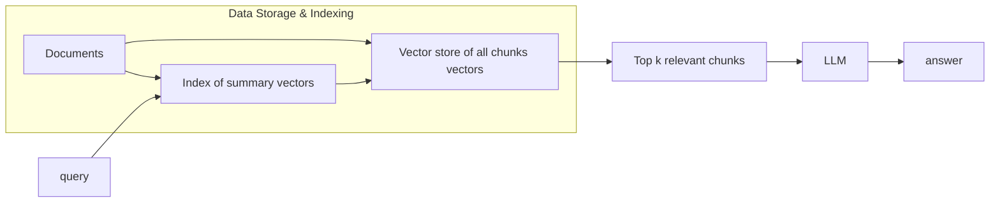
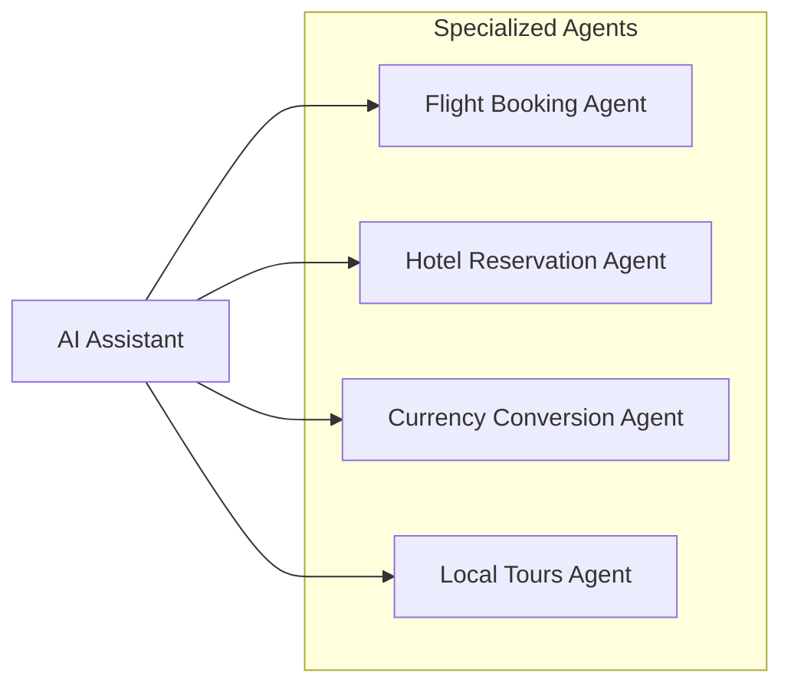

## 引言

请尝试编写代码解决以下问题之一：

- 编写一个应用程序，接受地理信息、卫星图像和一些历史天气信息，并预测明天的天气；
- 编写一个应用程序，接受自然文本表示的问题，并正确回答该问题；
- 编写一个应用程序，接受一张图像，识别出该图像所包含的人，并在每个人周围绘制轮廓；
- 编写一个应用程序，向用户推荐他们可能喜欢，但在自然浏览过程中不太可能遇到的产品。

## AI（Artificial Intelligence）


人工智能：用机器来模仿人类学习以及其他方面的智能。

> 现在AI常被指：`大语言模型（LLM：Large Language Model）`或者`transformer decode only`架构的模型簇

- 机器学习是一种途径实现人工智能
- 深度学习是基于机器学习方法发展而来

---

### 机器学习

#### 领域


- 预测推荐：销量预测、量化投资、广告推荐、相似推荐等；
- 图像识别：OCR、人脸识别、物品边界检测等；
- 自然语言：情感分析、文本翻译、文本分类检测；

#### 概念

**从数据中自动分析获得模型，通过模型对未知数据预测。**

组件：

1. 用来学习的*数据*（data）；`“Garbage in, garbage out.”`
2. 转换数据的*模型*（model）；
3. *目标函数*（objective function）:现在更多叫损失函数（loss function），用来量化模型的有效性（预测值和真实值的差异大小）；
4. 调整模型参数以优化目标函数的*算法*（algorithm）。【为了让目标函数的值最小】


#### 分类

##### 监督学习

###### 分类（离散）问题

🌰：1w张图片要么是周杰伦，要么系陶喆。


- 特征值：周杰伦/陶喆的图片
- 目标值：周杰伦/陶喆 - 不同的人（类型）

###### 回归（连续）问题

🌰：玩三角粥猛攻，选择干员、配几头几甲、带啥枪，最后预测能赚多少钱？

- 特征值：头、甲、枪、人物
- 预测值：money💰（连续值）

##### 无监督学习

没答案（聚类）

🌰：重生之我成了巴黎世家的设计师，夺回正常人类的审美，我设计了一款鞋子，要配鞋码，通过收集10w人🦶的数据，让机器基于密度归成S、M、L、XL、XXL。

通常用来分组、找规律、抓异类

---

##### 二者区别


###### 存在的问题

- 监督学习：需要大量的标注数据，人工进行标记；模型训练出来只能识别周杰伦、陶喆，我来个方大同你不炸了
- 无监督学习：黑盒，对结果很难解释和验证；预测结果不准确

#### 流程


##### 训练步骤

1. 从一个随机初始化参数的模型开始，这个模型基本没有“智能”；
2. 获取一些数据样本（例如，音频片段以及对应的是或否标签）；
3. 调整参数，使模型在这些样本中表现得更好；（调参侠登场）
4. 重复第（2）步和第（3）步，直到模型在任务中的表现令人满意。


> 参数可以被看作旋钮，旋钮的转动可以调整程序的行为。
>
> 任一调整参数后的程序被称为*模型*（model）。
>
> 黑盒

#### Diving

[特征工程、分类算法、回归算法、聚类算法](https://blog.liqingchen.com/%E4%BA%BA%E5%B7%A5%E6%99%BA%E8%83%BD/2025/09/24/%E6%9C%BA%E5%99%A8%E5%AD%A6%E4%B9%A0)

---

机器学习还是需要人去对特征进行一系列的操作。

### 深度学习

对比机器学习：

- 机器学习的特征工程步骤是要靠手动完成的，而且需要大量领域专业知识
-  深度学习通常由多个层组成，它们通常将更简单的模型组合在一起，将数据从一层传递到另一层来构建更复杂的模型。通过训练大量数据自动得出模型，不需要人工特征提取环节。

> 深度学习算法试图从数据中学习高级功能，这是深度学习的一个非常独特的部分。减少了为每个问题开发新特征提取器的任务。适合用在难提取特征的图像、语音、自然语言处理领域。


深度学习的参数很大，需要大量数据去多次优化训练参数，数据越多表现越好。


> 1. 大量的训练数据集
> 2. 大量的训练算力
>
> 可能要花费数天、甚至数周的时间，才能使用数百万张图像的数据集训练出一个深度网络。

#### 应用

- 图像识别
  - OCR（Optical Character Recognition）
  - 物体识别
    - 目标检测（Yolo）
  - 场景识别
  - 车型识别
  - 人脸检测识别
  - 人脸关键点定位
  - 人脸身份认证

- 自然语言处理（NLP：Natural Language Processing）
  - 机器翻译（Bert）
  - 文本识别
  - 聊天对话
    - 大语言模型（Transfomer- Decode Only）
- 语音技术
  - 语音识别
  - TTS（Text-to-Speech）
  - ASR(Automatic Speech Recognition)/STT（Speech-to-Text）
- 自动驾驶
- 文生图（Diffusion）
- ...

#### 模型家族

##### 神经网络

- 线性神经网络
  - 线性回归
  - softmax回归
- 多层感知机
- 卷积神经网络
- 循环神经网络
- ...

##### 视觉

- 全卷积网络

##### 自然语言

- word2vec
- bert

#### 注意力机制

###### 非自主性


###### 自主性


- 注意力提示/汇聚

  

- 多头注意力

- 自注意力

  - [Transformer](https://blog.liqingchen.com/%E4%BA%BA%E5%B7%A5%E6%99%BA%E8%83%BD/2024/10/07/Attention-Is-All-You-Need-%E5%9C%A3%E7%BB%8F%E5%AD%A6%E4%B9%A0)

    

#### Diving

[神经网络、感知机、卷积神经网络](https://blog.liqingchen.com/%E4%BA%BA%E5%B7%A5%E6%99%BA%E8%83%BD/2025/09/26/%E6%B7%B1%E5%BA%A6%E5%AD%A6%E4%B9%A0)

### 推荐算法


#### 分类

- 协同过滤
- 内容推荐
- 知识推荐
- ...

#### Diving

暂略

[jump](https://blog.liqingchen.com/%E4%BA%BA%E5%B7%A5%E6%99%BA%E8%83%BD/2025/08/06/%E6%8E%A8%E8%8D%90%E7%AE%97%E6%B3%95%E5%A4%8D%E4%B9%A0)

[learn](https://datawhalechina.github.io/fun-rec/index.html)

---

> 后续AI一词特指与大语言模型相关的内容

## AI算法

`大语言模型（Large Language Model）`

### 分类

- LLM
  - Dense LLM
    - `Llama series`
    - `Qwen1、2（部分）`
    - ...
  - MoE LLM（Mixture of Expert）
    - `豆包`
    - `DeepSeek- R1`
    - `Qwen3-235B-A22B`
    - ...
- VLM (Vision-Language Model)
  - `GPT-4o`
  - `Qwen-VL`
  - ...
- MLM (Multi-Modal Large Model)
  - 其他多模态模型（语音、视频等）

### 目标

LLM 的训练一般采用 **语言建模任务**：

- **自回归语言建模（Causal LM）**
  预测下一个词：
  $$
  P(w_t | w_1, w_2, ..., w_{t-1})
  $$

- **掩码语言建模（Masked LM）**
  预测被掩码的词（如 BERT）。

在 LLM 中，多数使用 **自回归建模**（例如 GPT 系列）。


### 架构


基于**Transformer** (Decode only)架构，具体包括：

- **分词器（Tokenizer）**

  基于规则（BPE，1994）的传统分词器(其实不算在神经网络中)

- **Embedding 层**
   将离散的词（token）映射到连续的向量空间。
   公式：
  $$
  x_i = E \cdot one\_hot(w_i)
  $$

- **位置编码（Positional Encoding）**
   为序列引入位置信息。
   常见方法：

   - 正余弦函数编码（sin, cos）
   - 旋转位置编码（苏神）
   
- **自注意力机制（Self-Attention）**
   捕捉序列中不同词之间的依赖关系。
   核心公式：
  $$
  Attention(Q,K,V) = softmax\left(\frac{QK^T}{\sqrt{d_k}}\right)V
  $$

- **多头注意力（Multi-Head Attention）**
   并行学习不同的注意力模式，提升表达能力。

- **前馈网络（Feed-Forward Network）**
   非线性变换，增加模型容量。

- **残差连接 + LayerNorm**
   保证梯度稳定，提升训练效果。

#### Code

```python
Qwen3ForCausalLM(
  (model): Qwen3Model(
    (embed_tokens): Embedding(151936, 1024)
    (layers): ModuleList(
      (0-27): 28 x Qwen3DecoderLayer(
        (self_attn): Qwen3Attention(
          (q_proj): Linear(in_features=1024, out_features=2048, bias=False)
          (k_proj): Linear(in_features=1024, out_features=1024, bias=False)
          (v_proj): Linear(in_features=1024, out_features=1024, bias=False)
          (o_proj): Linear(in_features=2048, out_features=1024, bias=False)
          (q_norm): Qwen3RMSNorm((128,), eps=1e-06)
          (k_norm): Qwen3RMSNorm((128,), eps=1e-06)
        )
        (mlp): Qwen3MLP(
          (gate_proj): Linear(in_features=1024, out_features=3072, bias=False)
          (up_proj): Linear(in_features=1024, out_features=3072, bias=False)
          (down_proj): Linear(in_features=3072, out_features=1024, bias=False)
          (act_fn): SiLU()
        )
        (input_layernorm): Qwen3RMSNorm((1024,), eps=1e-06)
        (post_attention_layernorm): Qwen3RMSNorm((1024,), eps=1e-06)
      )
    )
    (norm): Qwen3RMSNorm((1024,), eps=1e-06)
    (rotary_emb): Qwen3RotaryEmbedding()
  )
  (lm_head): Linear(in_features=1024, out_features=151936, bias=False)
)
```

#### Tokenizer

体验：https://tiktokenizer.vercel.app/

| Tokenizer模型     | 词表大小 | 来源               |
| ----------------- | -------- | ------------------ |
| yi tokenizer      | 64,000   | 01万物（中国）     |
| qwen2 tokenizer   | 151,643  | 阿里云（中国）     |
| glm tokenizer     | 151,329  | 智谱AI（中国）     |
| mistral tokenizer | 32,000   | Mistral AI（法国） |
| llama3 tokenizer  | 128,000  | Meta（美国）       |

[Diving](https://blog.liqingchen.com/%E4%BA%BA%E5%B7%A5%E6%99%BA%E8%83%BD/2025/07/05/Language-Modeling-from-Scratch-01#h-tokenizer)

#### Transformer

##### Embedding layer

一个线性层（多个线性回归组成的）

```python
import torch
import torch.nn as nn

# Define the embedding layer
vocab_size = 30000  # Number of unique categories (e.g., vocabulary size)
embedding_dim = 1024    # Dimension of each embedding vector

embedding_layer = nn.Embedding(vocab_size, embedding_dim)

# Example input (batch of tokens)
batch_tokens = torch.tensor([[1, 3, 5, 7]])  # tensor shape [1, 4]

# Forward pass to obtain embeddings
output_embeddings = embedding_layer(batch_tokens) # tensor shape [1, 4, 1024]
```

##### 圣经

[Attention Is All You Need |圣经学习](https://blog.liqingchen.com/人工智能/2024/10/07/Attention-Is-All-You-Need-圣经学习.html)

#### 输出采样（Output）

经过softmax输出后，进行预测采样

##### 采样策略（Decoding）

在概率分布 $P$ 上，选择下一个 token 有多种方式：

- **Greedy Search**（贪心）

  - 选取最大概率的 token
  - 确定性强，但容易生成重复、机械化文本
  - 例：argmax $P(i)$

- **Sampling**（随机采样）

  - 按分布 $P$ 抽样
  - 更有创造性，但可能不连贯

- **Temperature** 调整分布（控制“随机性”）

  $P(i)=\frac{\exp(z_i/T)}{\sum_j \exp(z_j/T)}$

  假设我们有 3 个原始分数 \(z = [2, 1, 0]\)，观察不同 T 下的概率分布：

  | T 的取值          | \(P(1)\)（对应 \(z=2\)） | \(P(2)\)（对应 \(z=1\)） | \(P(3)\)（对应 \(z=0\)） | 分布的 “尖锐感”             |
  | ----------------- | ------------------------ | ------------------------ | ------------------------ | --------------------------- |
  | \(T=1\)（正常）   | \(\approx 0.665\)        | \(\approx 0.245\)        | \(\approx 0.090\)        | 中等                        |
  | \(T=0.1\)（低温） | \(\approx 0.999\)        | \(\approx 0.001\)        | \(\approx 0.000\)        | 极尖锐（接近 “只选最大的”） |
  | \(T=10\)（高温）  | \(\approx 0.378\)        | \(\approx 0.329\)        | \(\approx 0.293\)        | 极平缓（接近均匀）          |

- **Top-K Sampling**

  - 限定候选集为概率最高的 K 个，再随机抽样

- **Top-P Sampling (Nucleus)**

  - 限定候选集为累积概率 ≥ p 的最小集合，再随机抽样

- **Beam Search**

  - 一次保留多条候选路径，搜索全局最优序列（常用于机器翻译）

#### 现在的架构优化

##### Diving

[model](https://blog.liqingchen.com/%E4%BA%BA%E5%B7%A5%E6%99%BA%E8%83%BD/2025/07/15/Language-Modeling-from-Scratch-03)

### 训练方式


#### 预训练 - PT


- 大量文本数据喂给模型，学习知识
- 无监督学习
- 模型可以接着一句话继续输出内容（文本补全）


#### 微调 - SFT

`指令微调（Instruction Tuning）`，又称`监督微调（Supervised Fine-tuning, SFT）`

- 让模型拥有对话的能力（以问答形式进行任务求解的能力）

一般来说，指令微调很难教会大语言模型预训练阶段没有学习到的知识与能力，它主要起到了对于模型能力的激发作用。

##### 方式

- 全参微调
- LoRA
- QLoRA
- DoRA
- LoRA+
- ReFT
- LISA
- ...

#### 强化学习 - RL

也可以叫`人类对齐(Human Alignment)`，偏好优化（Preference Optimization，PO）

-  RLHF - `基于人类反馈的强化学习（Reinforcement Learning from Human Feedback）`
- PPO - `近端策略优化（Proximal Policy Optimization）`
- DPO - `直接偏好优化（Direct Preference Optimization）`
- GRPO
- ORPO
- GSPO
- ...

#### 量化

- int4
- int8
- fp8

##### 框架

- BNB
- AWQ
- GPTQ
- ....

### 训练技术


- 3D 并行训练
  1. 数据并行（Data Parallelism）
  2. 流水线并行（Pipeline Parallelism）
  3. 张量并行（Tensor Parallelism）
- 零冗余优化器
  - DeepSpeed：仅在每个 GPU 上保留部分模型参数和优化器参数，当需要时再从其它 GPU 中读取
- 混合精度训练
  - Use {bfloat16, fp8} for the forward pass (activations).
  - Use float32 for the rest (parameters, gradients).

#### 分布式训练

- ray

### 推理

- 预装填（Prefilling）
- KV-Cache

### 部署

- vLLM
- PyTorch
- Transformers
- Megatron
- LmDeploy
- ...

## AI应用

> 业务流程抽象后编排给到模型
>
> Future：模型在线更新，自主发现

### Function Call/Tool Call

https://platform.openai.com/docs/guides/function-calling?lang=python&strict-mode=enabled#page-top


| Field         | Description                                                  |
| :------------ | :----------------------------------------------------------- |
| `type`        | This should always be `function`                             |
| `name`        | The function's name (e.g. `get_weather`)                     |
| `description` | Details on when and how to use the function                  |
| `parameters`  | [JSON schema](https://json-schema.org/) defining the function's input arguments |
| `strict`      | Whether to enforce strict mode for the function call         |

### OpenAI API

https://platform.openai.com/docs/api-reference/introduction

> 懂传参，你就已经是练气13层了
>
> 会tool call，你就已经是元婴中期了
>
> 你会promptive engineering，你就是是道祖了

```shell
curl --request POST \
  --url https://api.siliconflow.cn/v1/chat/completions \
  --header 'Authorization: Bearer <token>' \
  --header 'Content-Type: application/json' \
  --data '{
    "model": "Qwen/Qwen3-8B",
    "messages": [
        {
            "content": "角色设定",
            "role": "system"
        },
        {
            "content": "你好",
            "role": "user"
        },
        {
            "content": "你好呀，我是xxx",
            "role": "assistant"
        },
        {
            "role": "assistant",
            "content": null,
            "tool_calls": [
                {
                    "id": "call_001",
                    "type": "function",
                    "function": {
                        "name": "get_weather",
                        "arguments": "{\"location\": \"北京\"}"
                    }
                }
            ]
        },
        {
            "role": "tool",
            "tool_call_id": "call_001",
            "content": "{\"temperature\": \"22°C\", \"condition\": \"晴\"}"
        },
        {
            "content": [
                {
                    "image_url": {
                        "detail": "auto",
                        "url": "123"
                    },
                    "type": "image_url"
                }
            ],
            "role": "user"
        }
    ],
    "stream": true,
    "max_tokens": 2048,
    "stop": "token_id",
    "temperature": 0.5,
    "top_p": 0.7,
    "top_k": 0.8,
    "frequency_penalty": 1.2,
    "n": 2,
    "enable_thinking": true,
    "thinking_budget": 4096,
    "response_format": {
        "type": "json_object"
    },
    "parallel_tool_calls": true,
    "tools": [
        {
            "function": {
                "strict": true,
                "name": "get_time",
                "description": "获取时间",
                "parameters": {
                    "location": "string"
                }
            },
            "type": "function"
        },
        {
            "type": "function",
            "function": {
                "name": "CodeRunner",
                "description": "代码执行器，支持运行 python 和 javascript 代码",
                "parameters": {
                    "properties": {
                        "language": {
                            "type": "string",
                            "enum": [
                                "python",
                                "javascript"
                            ]
                        },
                        "code": {
                            "type": "string",
                            "description": "代码写在这里"
                        }
                    },
                    "type": "object"
                }
            }
        }
    ]
}'
```

> 先调温度，然后TopP和TopK去筛候选集，二者结果合并后随机采样

### Prompt Engineering

**LLM 的局限性**

1. **不一致性**
   LLMs 使用概率方法生成文本，每次选择下一个单词时并非总是选择最可能的那个，而是从可能的下一个单词分布中采样。这导致对于相同的查询可能会产生不同的响应。

2. **上下文敏感性**
   LLMs 对上下文高度敏感，对话历史或查询方式的微小变化都可能导致不同的回答。

3. **幻觉现象**

   由于其概率性质，LLM 有时会给出不正确或不符合事实的响应。

> 思想永存

#### 提示词要素

提示词可以包含以下任意要素：

- **指令**：想要模型执行的特定任务或指令。
- **上下文**：包含外部信息或额外的上下文信息，引导语言模型更好地响应。
- **输入数据**：用户输入的内容或问题。
- **输出指示**：指定输出的类型或格式。

#### 提示方式

- 零样本提示
- 少样本提示
- CoT（Chain-of-Thought，链式思考）
- 自我一致性
- Prompt chaining
- 生成知识提示
- ToT（Tree-of-Thought，思维树）
- ReAct

##### CoT


- Few-shot

  ```text
  Question: Tom and Elizabeth have a competition to climb a hill. Elizabeth takes 30 minutes to climb the hill. Tom takes four times as long as Elizabeth does to climb the hill. How many hours does it take Tom to climb up the hill?
  Answer: It takes Tom 30*4 = <<30*4=120>>120 minutes to climb the hill.
  It takes Tom 120/60 = <<120/60=2>>2 hours to climb the hill.
  So the answer is 2.
  ===
  Question: Jack is a soccer player. He needs to buy two pairs of socks and a pair of soccer shoes. Each pair of socks cost $9.50, and the shoes cost $92. Jack has $40. How much more money does Jack need?
  Answer: The total cost of two pairs of socks is $9.50 x 2 = $<<9.5*2=19>>19.
  The total cost of the socks and the shoes is $19 + $92 = $<<19+92=111>>111.
  Jack need $111 - $40 = $<<111-40=71>>71 more.
  So the answer is 71.
  ===
  Question: Marty has 100 centimeters of ribbon that he must cut into 4 equal parts. Each of the cut parts must be divided into 5 equal parts. How long will each final cut be?
  Answer:
  ```

- Zero-shot

  ```text
  Question: Marty has 100 centimeters of ribbon that he must cut into 4 equal parts. Each of the cut parts must be divided into 5 equal parts. How long will each final cut be?
  Answer: Let's think step by step.
  ```

##### ReAct


#### 网址

- https://lilianweng.github.io/posts/2023-03-15-prompt-engineering/
- https://www.promptingguide.ai/zh

### Context Engineering

构建动态系统，适当的位置提高正确的信息和工具


- 动态
- 正确信息
- 合适的工具
- 格式（format matters）
- 模型
  1. 不同模型训练数据差异
  2. 模型本身能力

`提供完整且结构化的上下文 比让模型通过思考、别花活更重要`

### RAG

`检索增强生成（Retrieval-Augmented Generation）`


前半段基本就是推荐系统的召回+粗排+精排的逻辑

- 文档读取（什么牛鬼蛇神文档都有）
- 文本切割（规则选取，不同内容不同规则）
- embedding向量化（模型对专业文档内容认知不足，向量化的精准度不够）
- 多路召回检索（RAG Fusion）
- rerank打分排序
- prompt塞给模型（用户提问模糊，要不要去检索）

> 数据质量极大程度上决定RAG的效果
>
> - 可以增强模型的知识（注入新知识）
> - 精准事实传入
> - 相关性、准确型提高


#### 优化


##### 文档读取

- 程序读取
- OCR（字符识别）
- OCR（版面分析）
- 恢复页面（图表断层，多模态）

##### 文本切割

- 语义切割（LLM）
- 使用LLM提高信息密度（直接对文档块提取）

##### 排序召回

###### RAG Fusion

接收用户query时，让大模型生成5-10个相似的query，然后每个query去匹配5-10个文本块，接着对所有返回的文本块再做个倒序融合排序，如果有需求就再加个精排，最后取Top K个文本块拼接至prompt。

> 增加了召回率，但是还是没解决用户意图模糊的问题

###### 分层索引召回



##### 向量模型

- 嵌入模型微调
- 构造热词

#### 变种


##### KAG/GraphRAG

[GraphRAG](https://github.com/microsoft/graphrag)

- 从原始文本中提取[知识图谱](https://blog.liqingchen.com/%E4%BA%BA%E5%B7%A5%E6%99%BA%E8%83%BD/2025/03/12/KnowledgeGraph)
- 构建社区层级结构
- 为这些社区生成摘要
- 在 RAG 任务中利用这些结构提升性能
  1. global search
  2. local search

> 烧token，烧钱

### MCP

[MCP](https://modelcontextprotocol.io/docs/getting-started/intro) （Model Context Protocol）是一个基于 JSON-RPC 的协议，通信层一般用 WebSocket 或 stdio。

核心概念：

- **Server**：你写的外部服务（暴露资源/工具）。
- **Client**：模型运行时（如 GPT-4.1、Claude 3.5 等）会作为客户端访问 MCP server。
- **Capabilities**：你要声明自己支持哪些能力，比如工具调用、文件读取、资源列表。


#### 流程

1. **初始化（initialize）**：客户端启动时与 Server 握手，确认协议版本、Server 能力（如是否支持工具调用）。
2. **工具列表（tools/list）**：客户端查询 Server 提供的可用工具（`get_time`）。
3. **工具调用（tools/call）**：客户端调用具体工具，Server 执行并返回结果。

**标准输入输出（stdin/stdout）**：通过`sys.stdin`读请求、`sys.stdout`返回响应，这是 MCP 推荐的轻量级通信方式（无需 HTTP 服务器，适合本地进程间通信）。

#### vscode演示

```python
# mcp_time_server.py
import sys
import json
import datetime


def handle_request(request):
    method = request.get("method")

    # 1. 初始化握手
    if method == "initialize":
        return {
            "jsonrpc": "2.0",
            "id": request.get("id"),
            "result": {
                "protocolVersion": "2024-11-05",
                "capabilities": {
                    "tools": True
                },
                "serverInfo": {
                    "name": "time-server",
                    "version": "0.1.0"
                }
            }
        }

    # 2. 工具列表
    if method == "tools/list":
        return {
            "jsonrpc": "2.0",
            "id": request.get("id"),
            "result": {
                "tools": [
                    {
                        "name": "get_time",
                        "description": "Get current system time",
                        "inputSchema": {"type": "object", "properties": {}}
                    }
                ]
            }
        }

    # 3. 工具调用
    if method == "tools/call":
        params = request.get("params", {})
        if params.get("name") == "get_time":
            now = datetime.datetime.now().isoformat()
            return {
                "jsonrpc": "2.0",
                "id": request.get("id"),
                "result": {
                    "content": [
                        {"type": "text", "text": f"Current time is {now}"}
                    ]
                }
            }

    # 默认兜底
    return {
        "jsonrpc": "2.0",
        "id": request.get("id"),
        "error": {"code": -32601, "message": f"Method {method} not found"}
    }


def main():
    for line in sys.stdin:
        try:
            request = json.loads(line.strip())
            response = handle_request(request)
            print(json.dumps(response))
            sys.stdout.flush()
        except Exception as e:
            error = {
                "jsonrpc": "2.0",
                "id": None,
                "error": {"code": -32603, "message": str(e)},
            }
            print(json.dumps(error))
            sys.stdout.flush()


if __name__ == "__main__":
    main()

```

##### .vscode/mcp.json

```json
{
  "servers": {
    "time-server": {
      "command": "python3",
      "args": ["mcp_time_server.py"],
      "env": {}
    }
  }
}
```

> API2API，如果mcp服务器中存放太多内容，导致模型调用效果变差
>
> 对资源、接口做统一管理

### A2A 

`Agent2Agent` 

- https://github.com/a2aproject/A2A
- https://a2a-protocol.org/latest/topics/what-is-a2a/


和multi-agent对比



- 代理之间无法协同工作


- **A2A：** 标准化部署在不同组织并使用不同框架开发的代理之间的通信。
- **MCP：** 将模型连接到数据和外部资源。


#### Core

1. 用户
2. **A2A Client (Client Agent)**
3. **A2A 服务器（远程代理）**

#### ELements

- Agent Card：`https://{agent-server-domain}/.well-known/agent-card.json`
- Task：某个agent的一个work，记录生命周期等状态
- Message
- Part：TextPart、FilePart、DataPart
- Artifact：task期间输出的文档、图像等数据

#### Demo

```python
skill = AgentSkill(
        id='hello_world',
        name='Returns hello world',
        description='just returns hello world',
        tags=['hello world'],
        examples=['hi', 'hello world'],
    )


extended_skill = AgentSkill(
        id='super_hello_world',
        name='Returns a SUPER Hello World',
        description='A more enthusiastic greeting, only for authenticated users.',
        tags=['hello world', 'super', 'extended'],
        examples=['super hi', 'give me a super hello'],
    )


public_agent_card = AgentCard(
        name='Hello World Agent',
        description='Just a hello world agent',
        url='http://localhost:9999/',
        version='1.0.0',
        default_input_modes=['text'],
        default_output_modes=['text'],
        capabilities=AgentCapabilities(streaming=True),
        skills=[skill],  # Only the basic skill for the public card
        supports_authenticated_extended_card=True,
    )
```

##### reply

```python
// Non-streaming response
{"jsonrpc":"2.0","id":"xxxxxxxx","result":{"type":"message","role":"agent","parts":[{"type":"text","text":"Hello World"}],"messageId":"yyyyyyyy"}}
// Streaming response (one chunk)
{"jsonrpc":"2.0","id":"zzzzzzzz","result":{"type":"message","role":"agent","parts":[{"type":"text","text":"Hello World"}],"messageId":"wwwwwwww","final":true}}
```

### Text2SQL

//TODO

## AI Infra

**AI Infra涵盖一切跟开发部署相关的工具和流程**


- IaaS(**Infrastructure as a Service**)
- PaaS(**Platform as a Service**)
- SaaS(**Software as a Service**)
- MaaS(**Model as a Service**)

### GPU


#### MFU

[浮点数问题](https://blog.liqingchen.com/%E4%BA%BA%E5%B7%A5%E6%99%BA%E8%83%BD/2025/07/06/Language-Modeling-from-Scratch-02#h-float32)，模型计算时的精度损失

模型算力利用率（Model FLOPs Utilization， *MFU*）

- CPU的处理速度跟不上
- IO限制
- 小批量大小
- 内存带宽限制
- 分布式网络带宽限制

------


[实例](https://blog.liqingchen.com/%E4%BA%BA%E5%B7%A5%E6%99%BA%E8%83%BD/2025/07/06/Language-Modeling-from-Scratch-02#h-mfu)

### TODO

GPU并发架构

CUDA编程

RDMA/NVLink

