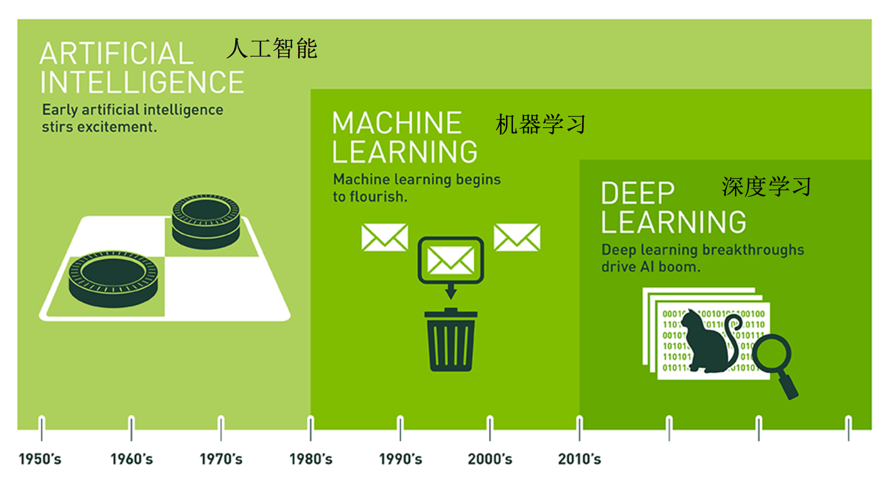
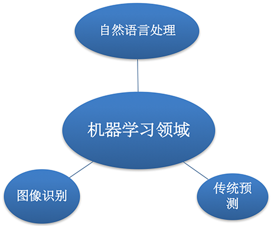
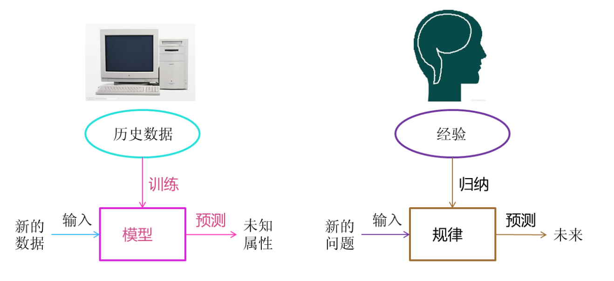
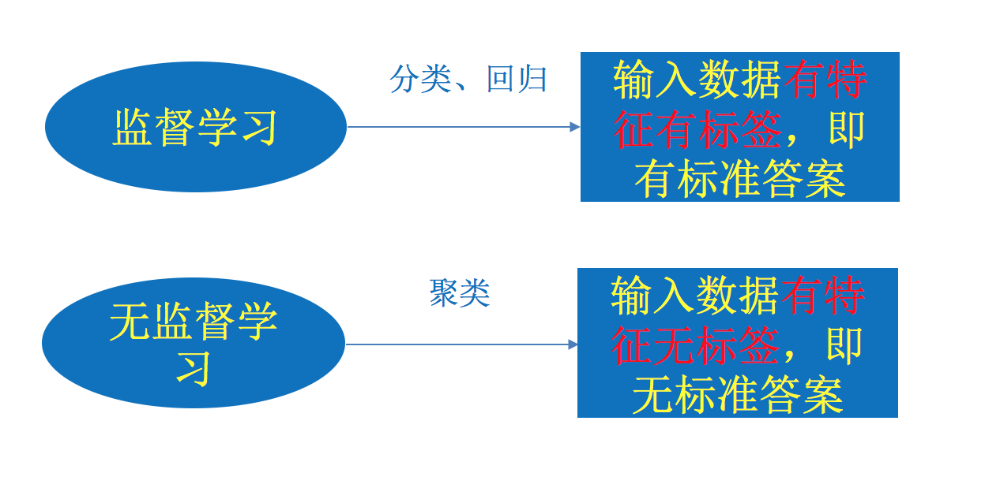
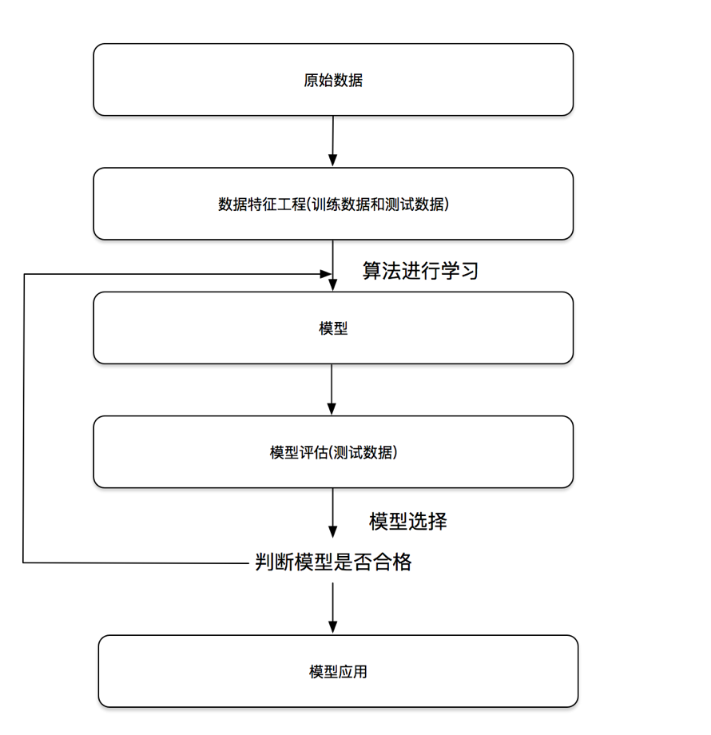
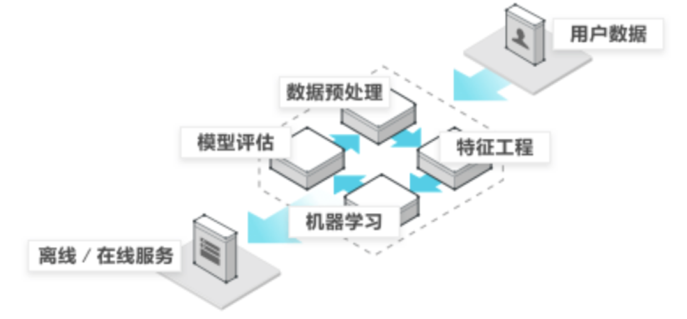

## AI

人工智能：用机器来模仿人类学习以及其他方面的智能。

> 现在常被代指：`大语言模型（LLM：Large Language Model）`

- 机器学习是一种途径实现人工智能
- 深度学习是基于机器学习方法发展而来

---

### 机器学习

#### 领域

- 预测推荐：销量预测、量化投资、广告推荐、相似推荐等；
- 图像识别：OCR、人脸识别、物品边界检测等；
- 自然语言：情感分析、文本翻译、文本分类检测；

#### 概念

**从数据中自动分析获得模型，通过模型对未知数据预测。**

#### 分类

##### 监督学习

- **分类**（离散）：

  🌰：1w张图片要么是周杰伦，要么系陶喆。

  

  - 特征值：周杰伦/陶喆的图片
  - 目标值：周杰伦/陶喆 - 不同的人（类型）

- **回归**（连续）：

  🌰：玩三角粥猛攻，选择干员、配几头几甲、带啥枪，最后预测能赚多少钱？

  - 特征值：头、甲、枪、人物
  - 预测值：money💰（连续值）

##### 无监督学习

没答案（聚类）

🌰：重生之我成了巴黎世家的设计师，夺回正常人类的审美，我设计了一款鞋子，要配鞋码，通过收集10w人🦶的数据，让机器基于密度归成S、M、L、XL、XXL。

通常用来分组、找规律、抓异类

---

##### 二者区别

###### 存在的问题

- 监督学习：需要大量的标注数据，人工进行标记；模型训练出来只能识别周杰伦、陶喆，我来个方大同你不炸了
- 无监督学习：黑盒，对结果很难解释和验证；预测结果不准确

#### 流程

#### Dive Into

## 特征工程

## 分类算法

## 回归/聚类算法

### 深度学习

## AI算法

transformer

attention is all you need

LLM的原理、架构、训练

## AI应用

RAG A2A MCP

## AI Infra

基础设施

显卡

