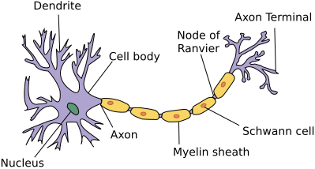
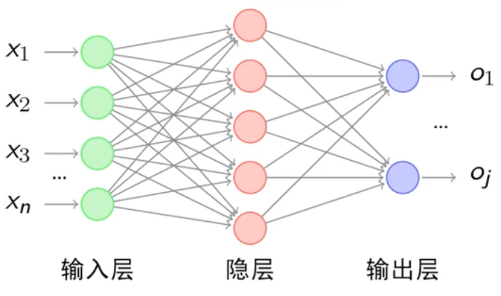
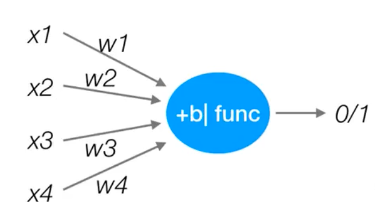
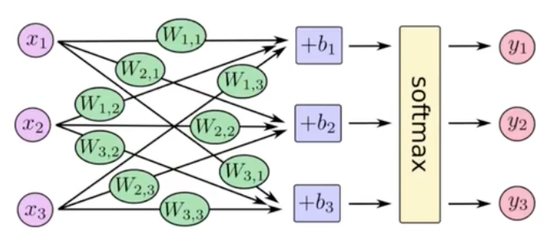
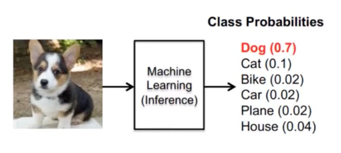
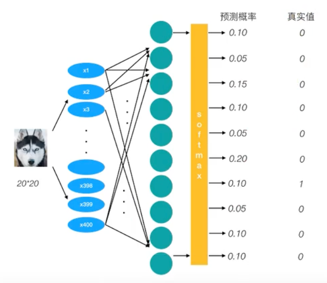
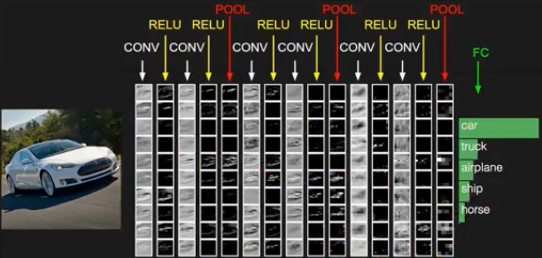
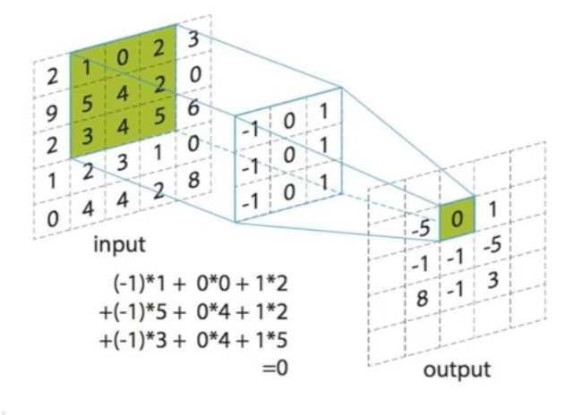
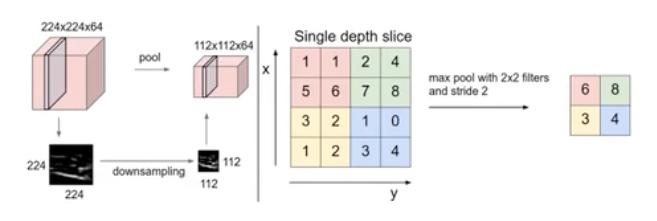
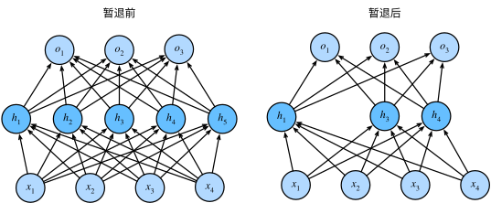

## 神经网络

**人工神经网络（Artificial Neural Network，ANN或者简称NN）**，模仿生物神经网络结构和功能的计算模型。

### 神经元

神经网络核心单元是**神经元（Neuron）**

神经元模拟生物神经元的 “接收 - 处理 - 输出” 逻辑，结构如下：

- **输入**：接收来自上一层的信号（如前一层神经元的输出 x1,x2,...,xn）；

- **权重与偏置**：每个输入对应一个可学习的权重 w1,w2,...,wn（表示输入的重要性），另有一个偏置 b（调整输出基线）；

- **激活函数**：对 “加权和 z=w1x1+w2x2+...+wnxn+b” 做非线性变换，输出 a=f(z)（引入非线性，让网络能拟合复杂函数）。

  | [常见激活函数](https://zh.d2l.ai/chapter_multilayer-perceptrons/mlp.html#subsec-activation-functions) | 公式                                       | 特点                                      | 适用场景              |
  | ------------------------------------------------------------ | ------------------------------------------ | ----------------------------------------- | --------------------- |
  | ReLU                                                         | $f(z) = \max(0, z)$                        | 计算简单、缓解梯度消失，稀疏激活          | 隐藏层（如 CNN、MLP） |
  | Sigmoid                                                      | $f(z) = \frac{1}{1 + e^{-t}}$              | 输出映射到 (0,1)，表示概率                | 二分类输出层          |
  | Softmax                                                      | $f(z_i) = \frac{e^{z_i}}{\sum_j e^{z_j}}$  | 输出映射到 (0,1) 且和为 1，表示多类别概率 | 多分类输出层          |
  | Tanh                                                         | $f(z) = \frac{e^z - e^{-z}}{e^z + e^{-z}}$ | 输出映射到 (-1,1)，中心对称               | RNN 隐藏层（早期）    |

### 网络结构

1. **输入层（Input Layer）**：接收原始数据，不做计算（如图像任务输入 “像素矩阵”，文本任务输入 “词向量”）
2. **隐藏层（Hidden Layer）**：核心特征抽象层，层数≥1（“深度” 即指隐藏层数量），层数越多，能学习的特征越复杂（如 10 层网络可学习 “物体语义”，100 层网络可学习 “场景逻辑”）
3. **输出层（Output Layer）**：输出任务结果，维度由任务决定（如二分类输出 1 个值，10 分类输出 10 个值）

每个小圆圈代表一个神经元，隐藏层和输出层由输入的数据计算后输出，输出层神经元只是输入

#### 特点

- 每个连接🔗之间都有个权值
- 同一层的神经元之间没有连接
- 最后输出结果对应的层也叫全连接层

### 线性神经网络

#### 线性回归/单层神经网络

将[线性回归模型](https://blog.liqingchen.com/%E4%BA%BA%E5%B7%A5%E6%99%BA%E8%83%BD/2025/09/24/%E6%9C%BA%E5%99%A8%E5%AD%A6%E4%B9%A0#h-%E7%BA%BF%E6%80%A7%E5%9B%9E%E5%BD%92)描述为一个神经网络，如图（隐去了权重和偏置的值，只显示连接）：

输入为$x_1, \ldots, x_d$， 因此输入层中的*输入数*（或称为*特征维度*，feature dimensionality）为$d$。 网络的输出为，因此输出层中的*输出数*是1。 需要注意的是，输入值都是已经给定的，并且只有一个*计算*神经元。 由于模型重点在发生计算的地方，所以通常我们在计算层数时不考虑输入层。 也就是说，上图神经网络的*层数*为1。 我们可以将线性回归模型视为仅由单个人工神经元组成的神经网络，或称为单层神经网络。

> 对于线性回归，每个输入都与每个输出（在上图有两个，在下图中只有一个输出）相连， 上图、下图的输出层称为*全连接层*（fully-connected layer）或称为*稠密层*（dense layer）。

线性回归可以理解为：**预测明天的精确温度是 25.3°C 还是 26.1°C。预报 25.3°C 但实际是 26.1°C 是有误差的，追求的是平均误差最小。**

#### softmax回归

softmax回归也是一个单层神经网络（拥有多个线性回归）

$$
\hat{\mathbf{y}} = \mathrm{softmax}(\mathbf{o})\quad \text{其中}\quad \hat{y}_j = \frac{\exp(o_j)}{\sum_k \exp(o_k)}
$$

> 尽管softmax是一个非线性函数，但softmax回归的输出仍然由输入特征的仿射变换决定。 因此，softmax回归是一个*线性模型*（linear model）。

### 感知机

`PLA：Perceptron Learning Algorithm`
$$
u = \sum_{i=1}^{n} w_{i}x_{i} + b\\y = sign(u) = \begin{cases} +1, & u > 0 \\-1, & u \leq 0 \end{cases}
$$

> 感知机是一种最基础的分类模型，类似于逻辑回归，不同的是，感知机的激活函数是`sign`，逻辑回归用的是`sigmoid`。
>
> 对比
>
> - 线性回归模型：$f(x) = w \cdot x + b$
> - 感知机模型：$f(x) = \text{sign}(w \cdot x + b)$，sign 是符号函数（当输入大于 0 时输出 1，小于等于 0 时输出 - 1）
> - 逻辑回归模型：$f(x) = \text{sigmoid}(w \cdot x + b)$，sigmoid函数是$\sigma(z) = \frac{1}{1 + e^{-z}}$，把线性模型输出的任意实数$(-\infty, +\infty)$（压缩到 (0, 1) 区间，结果可直接解释为 “样本属于正类的概率”（如输出 0.8 表示有 80% 的概率是正类）。

**单个感知机可以解决或、与问题**

### 多层感知机

`multilayer perceptron`，通常缩写为*MLP*

#### 隐藏层

#### 激活函数

通过`softmax`函数，让神经网络输出变成了概率输出

#### 损失函数

##### 交叉熵损失

$$
H_{y'}(y) = -\sum_{i} y'_i \log(y_i)
$$

##### 优化函数

SGD

### 对比

| 特性         | 线性回归                                     | 逻辑回归                                                     | Softmax回归                                                  | 感知机                                                       | 多层感知机                                                   |
| :----------- | :------------------------------------------- | :----------------------------------------------------------- | :----------------------------------------------------------- | :----------------------------------------------------------- | :----------------------------------------------------------- |
| **任务类型** | **回归**                                     | **二分类**                                                   | **多分类**                                                   | **二分类**                                                   | **分类、回归**（万能近似）                                   |
| **输出**     | **连续的数值**（任意实数）                   | **一个概率值**（0到1之间）                                   | **一个概率分布**（所有类别概率之和为1）                      | **离散的类别标签**（+1/-1 或 1/0）                           | 由输出层决定： - **一个值**（回归） - **一个概率**（二分类） - **一个概率分布**（多分类） |
| **目标**     | 最小化预测值与真实值的**差距**（拟合数据）。 | 最大化观测样本的**似然函数**，即让预测概率尽可能接近真实标签。 | 同逻辑回归，但扩展到多个类别。                               | 找到一个能**完全分开**两类数据的超平面（只要分类正确即可）。 | 通过多层非线性变换，学习数据中复杂的**非线性映射关系**。     |
| **激活函数** | **无**（线性函数）                           | **Sigmoid函数**（将输出压缩到(0,1)）                         | **Softmax函数**（将多个输出归一化为概率分布）                | **阶跃函数**（如Sign函数）                                   | **隐藏层**：使用非线性函数（如ReLU, Tanh）。 **输出层**：根据任务选择（无/Sigmoid/Softmax）。 |
| **几何解释** | 寻找最佳**拟合线**（或超平面）。             | 寻找最佳**决策边界**，输出的是到边界距离的**概率化**结果。   | 寻找多个**线性决策边界**。                                   | 寻找一个**决策边界**，只关心数据点在边界的哪一侧。           | 通过组合多个简单边界，来学习复杂的**曲线或曲面决策边界**。   |
| **损失函数** | **均方误差** - 衡量预测值的错误**程度**。    | **对数损失/二元交叉熵** - 衡量预测概率分布与真实分布的差异。 | **交叉熵损失** - 对数损失的多分类推广。                      | **感知机损失** - 只对**分错的样本**进行惩罚，且惩罚度固定。  | 由输出层决定，通常是对应任务的损失函数（如MSE、交叉熵）。    |
| **核心关系** | 基础模型                                     | = **线性回归** + **Sigmoid**                                 | = **多输出线性回归** + **Softmax**（可看作逻辑回归的多分类版） | = **线性回归** + **阶跃函数**（硬分类，而非概率输出）        | = **上述任一模型** + **隐藏层** + **非线性激活函数**         |

### 案例

//TODO：mnist手写体识别 （1.softmax回归，2.mlp）

### 体验

https://playground.tensorflow.org

## 卷积神经网络

加入了更有效的特征学习

### 应用场景

| 数据形态     | 视为“图像”                         | 典型应用               |
| :----------- | :--------------------------------- | :--------------------- |
| **图像**     | 天然的2D网格（像素）               | 图像分类、目标检测     |
| **文本**     | 1D网格（词序列）或2D网格（字符图） | 情感分析、垃圾邮件过滤 |
| **时间序列** | 1D网格（时间步）                   | 股价预测、心电图分析   |
| **图数据**   | 非规则网格（需要特殊处理）         | 社交网络分析、药物发现 |
| **棋盘游戏** | 2D网格（棋盘格子）                 | 围棋、国际象棋AI       |

### 网络结构

- 卷积层：在原始图像上平移提取特征
- 激活层：增加非线性分割能力（激活函数）
- 池化层：减少学习参数，降低网络复杂度
- 全连接层

### 卷积层

#### 卷积核

- 数量
- 大小
- 步长
- 0填充大小

### 池化层

pooling主要是特征提取

- 最大池化
- 平均池化

### 案例

//todo mnist手写体识别、验证码识别

## TODO

### Dropout

### 前向传播

### 反向传播

### 梯度消失

### 梯度爆炸
