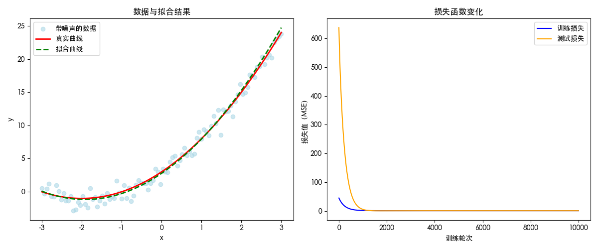

## 特征工程(Feature Engineering)

特征工程是使用**专业背景知识和技巧处理数据**，**使得特征能在机器学习算法上发挥更好的作用的过程**。

- 意义：会直接影响机器学习的效果

> 吴恩达：“Coming up with features is difficult, time-consuming, requires expert knowledge. “Applied machine learning” is basically feature engineering. ”
>
> 提出特征非常困难，耗时，需要专业知识。“应用机器学习”本质上就是特征工程。


### 特征抽取

**任意数据（如文本或图像）转换为可用于机器学习的数字特征**


> 当每个样本的特征类别数量都是相同的时候，其特征向量是固定长度的，这个长度被称为数据的*维数*（dimensionality）。 固定长度的特征向量是一个方便的属性，它可以用来量化学习大量样本。

#### 表格/字典特征提取

🌰：抢周杰伦的演唱会票

| 周杰伦演唱会地点 | 抢票结果(张) |
| ---------------- | ------------ |
| 北京             | 0            |
| 上海             | 2            |
| 悉尼             | 1            |

> - 字段1：是有限离散数据集，策略采用经典的独热编码`one-hot encode`
> - 字段2：本身就是数字特征，直接用

最终得到特征数据：

```python
# 特征名字：
 ['city=上海' 'city=北京' 'city=悉尼' 'result']
# 返回的结果:
 [[0. 1. 0. 0.]
 [1. 0. 0. 2.]
 [0. 0. 1. 1.]]
```

##### 代码

```python
from sklearn.feature_extraction import DictVectorizer


def dict_demo():
    """
    对字典类型的数据进行特征抽取
    :return: None
    """
    data = [{'city': '北京', 'result': 0}, {'city': '上海', 'result': 2}, {'city': '悉尼', 'result': 1}]
    transfer = DictVectorizer(sparse=False)  # 默认返回的是稀疏矩阵，设置成False返回的是一个二维数组
    data = transfer.fit_transform(data)
    print("特征名字：\n", transfer.get_feature_names_out())
    print("返回的结果:\n", data)

    return None


dict_demo()
```

#### 文本特征提取

🌰：英文歌词/中文三体段落

```python
# EN
[
  "i am so sick of love songs so tried of tears",
  "i am so sick of love songs so sad and slow"
]

# CN
[
  "云天明做了一件有史以来人类男性所能做过的最浪漫的事情，他用手中仅有的全部的三百万为程心买了一颗星星，一颗只属于她的星星...",
  "这一次，云天明为程心带来了一个微缩宇宙，一个拥有无限时间、由人工智能管理、只有程心享有操作和使用权限的宇宙。",
  "他曾送你一颗星星，现在，他又送你一个宇宙。"
]
```

> 策略
>
> - 比较简单的做法就是分词做`one-hot`
> - [TF-IDF](https://blog.liqingchen.com/%E4%BA%BA%E5%B7%A5%E6%99%BA%E8%83%BD/2025/05/20/TF-IDF)
> - 复杂点的[Tokenizer](https://blog.liqingchen.com/%E4%BA%BA%E5%B7%A5%E6%99%BA%E8%83%BD/2025/07/05/Language-Modeling-from-Scratch-01#h-tokenizer)

##### EN

```python
# 返回特征名字：
 ['am' 'and' 'love' 'of' 'sad' 'sick' 'slow' 'so' 'songs' 'tears' 'tried']
# 文本特征抽取 One-hot 结果：
 [[1 0 1 2 0 1 0 2 1 1 1]
 [1 1 1 1 1 1 1 2 1 0 0]]
```

##### CN

> 中文不能像英文进行空格的切分，所以需要进行分词的处理
>
> 通过中文分词工具[jieba]()预处理

```python
# 分词后的结果
['云 天明 做 了 一件 有史以来 人类 男性 所能 做 过 的 最 浪漫 的 事情 ， 他 用 手中 仅 有 的 全部 的 三百万 为 程心 买 了 一颗 星星 ， 一颗 只 属于 她 的 星星 ...', '这 一次 ， 云 天明 为 程心 带来 了 一个 微缩 宇宙 ， 一个 拥有 无限 时间 、 由 人工智能 管理 、 只有 程心 享有 操作 和 使用 权限 的 宇宙 。', '他 曾 送 你 一颗 星星 ， 现在 ， 他 又 送 你 一个 宇宙 。']
# 返回特征名字：
 ['一个' '一件' '一次' '一颗' '三百万' '事情' '享有' '人工智能' '人类' '使用' '全部' '只有' '天明' '宇宙'
 '属于' '带来' '微缩' '所能' '手中' '拥有' '操作' '无限' '时间' '星星' '有史以来' '权限' '浪漫' '现在'
 '男性' '程心' '管理']
# 文本特征抽取 One-hot 结果：
 [[0 1 0 2 1 1 0 0 1 0 1 0 1 0 1 0 0 1 1 0 0 0 0 2 1 0 1 0 1 1 0]
 [2 0 1 0 0 0 1 1 0 1 0 1 1 2 0 1 1 0 0 1 1 1 1 0 0 1 0 0 0 2 1]
 [1 0 0 1 0 0 0 0 0 0 0 0 0 1 0 0 0 0 0 0 0 0 0 1 0 0 0 1 0 0 0]]
  
# 附TF-IDF的结果
[[0.         0.24409132 0.         0.37127548 0.24409132 0.24409132
  0.         0.         0.24409132 0.         0.24409132 0.
  0.18563774 0.         0.24409132 0.         0.         0.24409132
  0.24409132 0.         0.         0.         0.         0.37127548
  0.24409132 0.         0.24409132 0.         0.24409132 0.18563774
  0.        ]
 [0.33578694 0.         0.22075973 0.         0.         0.
  0.22075973 0.22075973 0.         0.22075973 0.         0.22075973
  0.16789347 0.33578694 0.         0.22075973 0.22075973 0.
  0.         0.22075973 0.22075973 0.22075973 0.22075973 0.
  0.         0.22075973 0.         0.         0.         0.33578694
  0.22075973]
 [0.41779577 0.         0.         0.41779577 0.         0.
  0.         0.         0.         0.         0.         0.
  0.         0.41779577 0.         0.         0.         0.
  0.         0.         0.         0.         0.         0.41779577
  0.         0.         0.         0.54935123 0.         0.
  0.        ]]
```

##### 代码

```python
from sklearn.feature_extraction.text import CountVectorizer
import jieba


def text_en_count_demo():
    """
    对文本进行特征抽取，CountVectorizer
    :return: None
    """
    data = [
        "i am so sick of love songs so tried of tears",
        "i am so sick of love songs so sad and slow"
    ]
    # 1、实例化一个转换器类
    # transfer = CountVectorizer(sparse=False)
    transfer = CountVectorizer()
    # 2、调用fit_transform
    data = transfer.fit_transform(data)
    print("返回特征名字：\n", transfer.get_feature_names_out())
    print("文本特征抽取的结果：\n", data.toarray())

    return None


text_en_count_demo()


def cut_word(text):
    """
    对中文进行分词
    "哈吉米南北绿豆"————>"哈吉米 南北 绿豆"
    :param text:
    :return: text
    """
    # 用结巴对中文字符串进行分词
    text = " ".join(list(jieba.cut(text)))

    return text


def text_cn_count_demo():
    """
    对中文进行特征抽取
    :return: None
    """
    data = [
        "云天明做了一件有史以来人类男性所能做过的最浪漫的事情，他用手中仅有的全部的三百万为程心买了一颗星星，一颗只属于她的星星...",
        "这一次，云天明为程心带来了一个微缩宇宙，一个拥有无限时间、由人工智能管理、只有程心享有操作和使用权限的宇宙。",
        "他曾送你一颗星星，现在，他又送你一个宇宙。"
    ]
    # 将原始数据转换成分好词的形式
    text_list = []
    for sent in data:
        text_list.append(cut_word(sent))
    print(text_list)

    # 1、实例化一个转换器类
    # transfer = CountVectorizer(sparse=False)
    transfer = CountVectorizer()
    # 2、调用fit_transform
    data = transfer.fit_transform(text_list)
    print("返回特征名字：\n", transfer.get_feature_names_out())
    print("文本特征抽取的结果：\n", data.toarray())

    return None


text_cn_count_demo()


def text_cn_tfidf_demo():
    """
    对中文进行特征抽取
    :return: None
    """
    data = [
        "云天明做了一件有史以来人类男性所能做过的最浪漫的事情，他用手中仅有的全部的三百万为程心买了一颗星星，一颗只属于她的星星...",
        "这一次，云天明为程心带来了一个微缩宇宙，一个拥有无限时间、由人工智能管理、只有程心享有操作和使用权限的宇宙。",
        "他曾送你一颗星星，现在，他又送你一个宇宙。"
    ]
    # 将原始数据转换成分好词的形式
    text_list = []
    for sent in data:
        text_list.append(cut_word(sent))
    print(text_list)

    # 1、实例化一个转换器类
    # transfer = CountVectorizer(sparse=False)
    transfer = TfidfVectorizer(stop_words=['一种', '不会', '不要'])
    # 2、调用fit_transform
    data = transfer.fit_transform(text_list)
    print("返回特征名字：\n", transfer.get_feature_names_out())
    print("文本特征抽取的结果：\n", data.toarray())

    return None


text_cn_tfidf_demo()
```

### 特征预处理

通过**一些转换函数**将特征数据**转换成更加适合算法模型**的特征数据过程


**无量纲化**（说白了就是：不考虑数据的物理/统计单位，统一各个字段的范围区间）

- 标准化
- 归一化

> 无量纲化（Dimensionless Transformation）是**消除数据 “单位影响”、将不同量级 / 维度的变量转换为统一 “可比尺度”** 的数据预处理方法。其核心是通过数学变换，让原本带有物理 / 统计单位（如 “米”“千克”“万元”“次 / 月”）或差异极大数值范围（如 “年龄：0-120 岁”“收入：0-1000 万元”）的变量，变成 “无单位、数值范围相近” 的标准化形式，从而解决因 “量级差异” 导致的分析偏差。

#### 归一化

**把原始数据映射到(默认为[0,1])之间**
$$
X'=\frac{x-min}{max-min}
$$

$$
X{’'}= X' * (mx - mi) + mi
$$

$$
Tips:mx和mi是最终的数值区间，默认mx=1，mi=0
$$

##### 缺点

如果出现异常点（最大值和最小值有异常，可能某个最小值贼小），**鲁棒性较差**

#### 标准化

**把原始数据变换到均值为0，[标准差](https://blog.liqingchen.com/%E6%95%B0%E5%AD%A6/2022/02/02/%E6%95%B0%E5%AD%A6%E5%85%AC%E5%BC%8F%E8%AE%B0%E5%BD%95#h-%E6%96%B9%E5%B7%AE%E6%A0%87%E5%87%86%E5%B7%AE)为1范围内**
$$
X'=\frac{x-\mu}{\sigma}
$$

$$
\mu：平均值
$$

$$
\sigma：标准差
$$


### 特征降维

降低随机特征个数

#### 特征选择

- Filter（过滤式）
  - 低方差特征过滤
  - 相关系数：皮尔逊相关系数
- Embedded（嵌入式）：算法自动选择特征
  - 决策树：信息熵、信息增益
  - 正则化：L1、L2
  - 深度学习：卷积等

##### 过滤式

###### 低方差特征过滤

删除低方差的一些特征，前面讲过方差的意义。再结合方差的大小来考虑这个方式的角度。

- 特征方差小：某个特征大多样本的值比较相近
- 特征方差大：某个特征很多样本的值都有差别

代码

```python
import pandas as pd
from sklearn.feature_selection import VarianceThreshold


def variance_demo():
    """
    删除低方差特征——特征选择
    :return: None
    """
    data = pd.read_csv("factor_returns.csv")
    print(data)
    # 1、实例化一个转换器类
    transfer = VarianceThreshold(threshold=1)
    # 2、调用fit_transform
    data = transfer.fit_transform(data.iloc[:, 1:10])
    print("删除低方差特征的结果：\n", data)
    print("形状：\n", data.shape)

    return None


variance_demo()
```

###### 皮尔逊相关系数


**特点**

**相关系数的值介于–1与+1之间，即$–1≤ r ≤+1$**。

其性质如下：

- 当$r>0$时，表示两变量正相关，$r<0$时，两变量为负相关
- 当｜r｜ =1时，表示两变量为完全相关，当$r=0$时，表示两变量间无相关关系
- 当0<｜r｜<1时，表示两变量存在一定程度的相关。且｜r｜越接近1，两变量间线性关系越密切；｜r｜越接近于0，表示两变量的线性相关越弱
- 一般可按三级划分：｜r｜<0.4为低度相关；0.4≤｜r｜<0.7为显著性相关；0.7≤｜r｜<1为高度线性相关


#### 主成分分析（PCA）

- 定义：**高维数据转化为低维数据的过程**，在此过程中**可能会舍弃原有数据、创造新的变量**
- 作用：**是数据维数压缩，尽可能降低原数据的维数（复杂度），损失少量信息。**
- 应用：回归分析或者聚类分析当中

代码

```python
from sklearn.decomposition import PCA


def pca_demo():
    """
    对数据进行PCA降维
    :return: None
    """
    data = [[2, 8, 4, 5], [6, 3, 0, 8], [5, 4, 9, 1]]

    # 1、实例化PCA, 小数——保留多少信息
    transfer = PCA(n_components=0.9)
    # 2、调用fit_transform
    data1 = transfer.fit_transform(data)

    print("保留90%的信息，降维结果为：\n", data1)

    # 1、实例化PCA, 整数——指定降维到的维数
    transfer2 = PCA(n_components=3)
    # 2、调用fit_transform
    data2 = transfer2.fit_transform(data)
    print("降维到3维的结果：\n", data2)

    return None


pca_demo()

# 保留90%的信息，降维结果为：
 [[-3.13587302e-16  3.82970843e+00]
 [-5.74456265e+00 -1.91485422e+00]
 [ 5.74456265e+00 -1.91485422e+00]]
# 降维到3维的结果：
 [[-3.13587302e-16  3.82970843e+00  4.59544715e-16]
 [-5.74456265e+00 -1.91485422e+00  4.59544715e-16]
 [ 5.74456265e+00 -1.91485422e+00  4.59544715e-16]]
```

## 分类算法

### KNN

最邻近：找到k个最近的，哪个种类多就我就是哪一类。取决于K的选值和距离计算方式。

> k的选值可以用交叉验证
>

距离公式：

- 欧氏距离
- 曼哈顿距离

#### 欧式距离

$$
d_{12}=\sqrt{(x_1-x_2)^2+(y_1-y_2)^2}
$$


#### 曼哈顿距离

$$
d_{12}=|x_1-x_2|+|y_1-y_2|
$$


<iframe src="https://www.desmos.com/calculator/imgi4qg9zo?embed" width="500" height="500" style="border: 1px solid #ccc" frameborder=0></iframe>

**红线为欧式距离，绿加蓝为曼哈顿距离**

> `sklearn.neighbors.KNeighborsClassifier(n_neighbors=5,algorithm='auto')`
>
> 在 KNN（K 近邻）算法中，`algorithm`参数指定的是**查找最近邻的搜索算法**，而非直接计算距离的方式（距离计算由`metric`参数控制，如欧氏距离、曼哈顿距离等）。这些算法的核心区别在于**如何高效地找到与目标样本最接近的 K 个邻居**，尤其在高维或大数据集上会显著影响性能。
>
> 以下是各算法的特点：
>
> 1. **‘brute’（暴力搜索）**
>    - 原理：对每个目标样本，计算它与训练集中**所有样本**的距离，然后选取最近的 K 个。
>    - 优点：简单直接，适用于**低维、小数据集**，无需预处理。
>    - 缺点：时间复杂度高（O (n)，n 为样本数），大数据集上速度很慢。
>    - 适用场景：样本量小（如 n<10,000）或维度极低的情况。
> 2. **‘kd_tree’（KD 树）**
>    - 原理：通过构建 KD 树（一种对 k 维空间中的样本点进行划分的二叉树），减少距离计算次数。搜索时从根节点开始，逐步剪枝不可能包含最近邻的子树。
>    - 优点：比暴力搜索高效，尤其在**中低维数据**（通常维度 < 20）上表现好。
>    - 缺点：高维数据（如维度 > 50）上性能下降明显（“维度灾难”），树结构可能变得复杂。
>    - 适用场景：中低维、样本量中等的数据集。
> 3. **‘ball_tree’（球树）**
>    - 原理：构建球树（用超球体而非轴对齐的矩形划分空间），通过计算球间距离快速排除不可能的邻居。
>    - 优点：高维数据上的性能通常优于 KD 树，对 “维度灾难” 的耐受性更强。
>    - 缺点：构建树的过程比 KD 树复杂，低维数据上可能不如 KD 树高效。
>    - 适用场景：高维数据（如文本特征、图像特征）。
> 4. **‘auto’（自动选择）**
>    - 原理：由算法根据**数据的维度和样本量**自动选择最合适的搜索方法（通常在暴力搜索、KD 树、球树中权衡）。
>    - 优点：无需手动调参，适合大多数场景，尤其是不清楚数据特性时。
>    - 适用场景：大多数默认情况。
>
> 总结
>
> - 距离计算方式由`metric`参数决定（如`metric='euclidean'`表示欧氏距离）。
>
> - `algorithm`参数控制的是 “如何快速找到最近邻”，而非 “如何计算距离”。
>
> - 实际使用中，建议先尝试
>
>   'auto'
>   
>   ，若需优化性能，再根据数据维度和规模手动选择：
>
>   - 小数据集 / 低维 → `'brute'`
>  - 中低维 → `'kd_tree'`
>   - 高维 → `'ball_tree'`

#### 案例

https://www.kaggle.com/navoshta/grid-knn/data

//TODO：通过K近邻算法对鸢尾花数据集进行分类预测

//TODO：通过K近邻算法对鸢尾花数据集进行分类预测

### 朴素贝叶斯算法

用于概率推测，有稳定的分类效率

##### 拉普拉斯平滑系数

目的：防止计算出的分类概率为0

$$
P(F1|C)=\frac{Ni+\alpha}{N+\alpha m}
\\
\alpha 一般取1，m是特征词个数
$$
//TODO

### 决策树

if else结构，信息熵，信息增益，找特征权重最大的，树木可视化

//TODO

### 随机森林

- 用N来表示训练用例（样本）的个数，M表示特征数目。
  - 1、一次随机选出一个样本，重复N次， （有可能出现重复的样本）
  - 2、随机去选出m个特征, m <<M，建立决策树
- 采取bootstrap抽样（有放回的抽样）

//TODO

## 回归算法

### 线性回归

（linear regression）

> 在机器学习中，线性回归的 “线性” 指的是对**参数（权重）** 是线性的，说白了参数仅以一次方形式出现
>
> [playground.tensorflow.org](http://playground.tensorflow.org/)

$$
h_w(x)=y=w_1x_1+w_2x_2+w_3x_3+w_4x_4+...+b=w^T+b
$$

$$
w,x可以理解为矩阵：w = \begin{pmatrix}
b\\
w1\\
w2
\end{pmatrix},
x = \begin{pmatrix}
1\\
x1\\
x2\\
\end{pmatrix}
$$

$$
b是（bias)偏置
$$

#### 损失函数

最小二乘法
$$
J(\theta) = (h_w(x_1) - y_1)^2 + (h_w(x_2) - y_2)^2 + \cdots + (h_w(x_m) - y_m)^2 
$$

$$
= \sum_{i=1}^{m} (h_w(x_i) - y_i)^2
$$


为了减少损失，需要优化权重W

##### 回归性能

均方误差

$$
MSE=\frac{1}{m} \textstyle\sum_{i=1}^m(y_i-\overline{y})^2
$$

#### 优化算法

##### 正规方程

$$
w = (X^T X)^{-1} X^T y
$$

> 理解：X为特征值矩阵，y为目标值矩阵。直接求到最好的结果
>
> 缺点：当特征过多过复杂时，求解速度太慢并且得不到结果


##### 梯度下降(Gradient Descent)

$$
w_1 := w_1 - \alpha \frac{\partial \text{cost}(w_0 + w_1 x_1)}{\partial w_1}
$$

$$
w_0 := w_0 - \alpha \frac{\partial \text{cost}(w_0 + w_1 x_1)}{\partial w_0}
$$


> 理解：α为学习速率，需要手动指定（超参数），α旁边的整体表示方向
>
> 沿着这个函数下降的方向找，最后就能找到山谷的最低点，然后更新W值
>
> 使用：面对训练数据规模十分庞大的任务 ，能够找到较好的结果

- `SGD-随机梯度下降`

- `SAG-随机平均梯度下降`

> 反向传播是 “计算梯度、更新参数” 的核心算法，遵循 “链式法则”—— 从输出层到输入层，逐层计算损失函数对每个参数的梯度，再通过优化器更新参数。
>
> 流程：
>
> 1. 前向传播（Forward Pass）：输入数据通过网络，计算各层输出和最终损失 L；
> 2. 反向传播（Backward Pass）：从输出层开始，计算 L 对输出层参数的梯度 → 隐藏层参数的梯度 → 输入层参数的梯度（链式法则）；
> 3. 参数更新（Parameter Update）：用优化器根据梯度调整参数（如 w=w−η⋅∂w∂L，η 为学习率）。
>
> `梯度：损失函数对各个参数的偏导数集合`

#### 模拟

用机器学习反推一元二次方程的系数
$$
y=w_1x+w_2x^2+b \\w1=4 \\w_2=1\\b=3
$$

```python
import numpy as np
import matplotlib.pyplot as plt

# ------------------------------------------------------
# 1. 生成数据集（基于真实模型）
# ------------------------------------------------------
# 真实参数（我们希望模型通过训练学到这些值）
w1_true = 4  # x的系数
w2_true = 1  # x²的系数
b_true = 3  # 偏置项

# 生成输入特征x（-3到3之间均匀分布的100个点）
x = np.linspace(-3, 3, 100)

# 生成真实值y（无噪声）：y = 4x + x² + 3
y_true = w1_true * x + w2_true * (x ** 2) + b_true

# 加入随机噪声（模拟真实世界的数据误差）
np.random.seed(42)  # 固定随机种子，保证结果可复现
noise = np.random.normal(0, 1, size=x.shape)  # 均值0，标准差1的噪声
# 添加噪声
y = y_true + noise  # 带噪声的标签（模型需要拟合的数据）

# 不加噪声的话全是真实值，直接就loss到0了
# y = y_true

# 划分训练集和测试集（前80个为训练，后20个为测试）
x_train, x_test = x[:80], x[80:]
y_train, y_test = y[:80], y[80:]


# ------------------------------------------------------
# 2. 定义模型和损失函数
# ------------------------------------------------------
def model(x, w1, w2, b):
    """模型预测函数：y_pred = w1*x + w2*x² + b"""
    return w1 * x + w2 * (x ** 2) + b


def loss_function(y_pred, y_true):
    """均方误差损失（MSE）：衡量预测值与真实值的差距"""
    return np.mean((y_pred - y_true) ** 2)


# ------------------------------------------------------
# 3. 定义梯度下降算法（核心：通过梯度更新参数）
# ------------------------------------------------------
def gradient_descent(x, y, w1, w2, b, learning_rate):
    """
    计算损失函数对各参数的梯度，并更新参数
    参数：
        x: 输入特征
        y: 真实标签
        w1, w2, b: 当前参数
        learning_rate: 学习率（步长）
    返回：
        更新后的参数w1, w2, b
    """
    n = len(x)  # 样本数量
    y_pred = model(x, w1, w2, b)  # 当前预测值

    # 计算梯度（损失函数对各参数的偏导数）
    dw1 = (2 / n) * np.sum((y_pred - y) * x)  # 损失对w1的梯度
    dw2 = (2 / n) * np.sum((y_pred - y) * (x ** 2))  # 损失对w2的梯度
    db = (2 / n) * np.sum(y_pred - y)  # 损失对b的梯度

    # 更新参数（沿着梯度反方向移动，减小损失）
    w1_new = w1 - learning_rate * dw1
    w2_new = w2 - learning_rate * dw2
    b_new = b - learning_rate * db

    return w1_new, w2_new, b_new


# ------------------------------------------------------
# 4. 模型训练过程
# ------------------------------------------------------
# 初始化参数（随机猜测初始值）
w1 = np.random.randn()  # 随机初始化w1
w2 = np.random.randn()  # 随机初始化w2
b = np.random.randn()  # 随机初始化b

print("=" * 50)
print(f"初始参数：w1={w1:.4f}, w2={w2:.4f}, b={b:.4f}")

# 训练超参数
learning_rate = 0.001  # 学习率（控制更新步长）
epochs = 10000  # 训练轮次（迭代次数）

# 记录训练过程中的损失变化
train_losses = []
test_losses = []

# 开始训练
for epoch in range(epochs):
    # 用训练集更新参数
    w1, w2, b = gradient_descent(x_train, y_train, w1, w2, b, learning_rate)

    # 计算当前轮次的训练损失和测试损失
    y_pred_train = model(x_train, w1, w2, b)
    train_loss = loss_function(y_pred_train, y_train)
    train_losses.append(train_loss)

    y_pred_test = model(x_test, w1, w2, b)
    test_loss = loss_function(y_pred_test, y_test)
    test_losses.append(test_loss)

    # 每1000轮打印一次训练进度
    if (epoch + 1) % 1000 == 0:
        print(f"轮次 {epoch + 1}/{epochs}")
        print(f"  训练损失：{train_loss:.4f}")
        print(f"  测试损失：{test_loss:.4f}")
        print(f"  当前参数：w1={w1:.4f}, w2={w2:.4f}, b={b:.4f}\n")

# ------------------------------------------------------
# 5. 训练结果可视化
# ------------------------------------------------------
# 打印最终学到的参数和真实参数对比
print("=" * 50)
print(f"真实参数：w1={w1_true}, w2={w2_true}, b={b_true}")
print(f"学到的参数：w1={w1:.4f}, w2={w2:.4f}, b={b:.4f}")
print("=" * 50)

plt.rcParams["font.family"] = ["Heiti TC"]
plt.rcParams["axes.unicode_minus"] = False

# 绘制预测曲线与真实曲线对比
plt.figure(figsize=(12, 5))

# 子图1：数据与拟合曲线
plt.subplot(1, 2, 1)
plt.scatter(x, y, label="带噪声的数据", color="lightblue", alpha=0.6)
plt.plot(x, y_true, label="真实曲线", color="red", linewidth=2)
plt.plot(x, model(x, w1, w2, b), label="拟合曲线", color="green", linestyle="--", linewidth=2)
plt.xlabel("x")
plt.ylabel("y")
plt.legend()
plt.title("数据与拟合结果")

# 子图2：损失函数下降曲线
plt.subplot(1, 2, 2)
plt.plot(train_losses, label="训练损失", color="blue")
plt.plot(test_losses, label="测试损失", color="orange")
plt.xlabel("训练轮次")
plt.ylabel("损失值（MSE）")
plt.legend()
plt.title("损失函数变化")

plt.tight_layout()
plt.show()

```



```python
==================================================
初始参数：w1=-1.4154, w2=-0.4206, b=-0.3427
轮次 1000/10000
  训练损失：1.5893
  测试损失：5.5389
  当前参数：w1=3.4780, w2=0.9607, b=2.2217

轮次 2000/10000
  训练损失：0.9047
  测试损失：0.5952
  当前参数：w1=4.0534, w2=1.0815, b=2.6346

轮次 3000/10000
  训练损失：0.8901
  测试损失：0.7946
  当前参数：w1=4.1100, w2=1.0825, b=2.7274

轮次 4000/10000
  训练损失：0.8891
  测试损失：0.7860
  当前参数：w1=4.1110, w2=1.0769, b=2.7563

轮次 5000/10000
  训练损失：0.8890
  测试损失：0.7686
  当前参数：w1=4.1086, w2=1.0737, b=2.7671

轮次 6000/10000
  训练损失：0.8890
  测试损失：0.7597
  当前参数：w1=4.1072, w2=1.0723, b=2.7715

轮次 7000/10000
  训练损失：0.8890
  测试损失：0.7558
  当前参数：w1=4.1066, w2=1.0717, b=2.7734

轮次 8000/10000
  训练损失：0.8890
  测试损失：0.7542
  当前参数：w1=4.1064, w2=1.0715, b=2.7741

轮次 9000/10000
  训练损失：0.8890
  测试损失：0.7535
  当前参数：w1=4.1063, w2=1.0714, b=2.7744

轮次 10000/10000
  训练损失：0.8890
  测试损失：0.7532
  当前参数：w1=4.1062, w2=1.0713, b=2.7746

==================================================
真实参数：w1=4, w2=1, b=3
学到的参数：w1=4.1062, w2=1.0713, b=2.7746
==================================================
```

#### 案例

//TODO：波士顿房价预测

### 岭回归

带有L2正则化的线性回归

岭回归，其实也是一种线性回归。只不过在算法建立回归方程时候，加上正则化的限制，从而达到解决过拟合的效果

#### 范数

$$
L_p=||x||_p=\sqrt[p]{\textstyle\sum_{i=1}^nx_i^p},X=(x_1,x_2,...,x_n)
$$

**L2范数：表示向量元素的平方和再开平方**

损失函数：`最小二乘法 + L2范数`

#### 案例

//TODO：波士顿房价预测

### 逻辑回归

#### 输入

输入是一个线性回归的结果

$$
y=w_1x_1+w_2x_2+w_3x_3+w_4x_4+...+b
$$

#### 激活函数

`sigmoid函数`

$$
f(x)=\frac{1}{1+e^{-x}}
$$

<iframe src="https://www.desmos.com/calculator/p4il6bgjyj?embed" width="500" height="500" style="border: 1px solid #ccc" frameborder=0></iframe>

- 回归的结果输入到sigmoid函数当中
- 输出结果：[0, 1]区间中的一个概率值，默认为0.5为阈值

> 逻辑回归最终的分类是通过属于某个类别的概率值来判断是否属于某个类别，并且这个类别默认标记为1(正例),另外的一个类别会标记为0(反例)。（方便损失计算）

#### 损失函数


##### 对数似然损失

逻辑回归的损失

$$
\text{cost}(h_\theta(x), y) = 
\begin{cases} 
-\log(h_\theta(x)) & \text{if } y = 1 \\ -\log(1 - h_\theta(x)) & \text{if } y = 0 
\end{cases}
$$

<iframe src="https://www.desmos.com/calculator/yeljpqxo3l?embed" width="500" height="500" style="border: 1px solid #ccc" frameborder=0></iframe>

$$
cost(h_\theta(x), y) = \sum_{i=1}^{m} -y_i \log(h_\theta(x)) - (1 - y_i) \log(1 - h_\theta(x))
$$


#### 优化算法

SGD等

#### 案例

//TODO：癌症分类预测

## 聚类算法

### K-means（K均值聚类）


1. 随机设置K个特征空间内的点作为初始的聚类中心
2. 对于其他每个点计算到K个中心的距离，未知的点选择最近的一个聚类中心点作为标记类别
3. 接着对着标记的聚类中心之后，重新计算出每个聚类的新中心点（平均值）
4. 如果计算得出的新中心点与原中心点一样，那么结束，否则重新进行第二步过程


### 性能评估指标

#### 轮廓系数

$$
SC_i=\frac{b_i-a_i}{max(b_i,a_i)}
$$

> 注：对于每个点i 为已聚类数据中的样本 ，b_i 为i 到其它族群的所有样本的距离最小值，a_i 为i 到本身簇的距离平均值。最终计算出所有的样本点的轮廓系数平均值


### 案例

//TODO：Instacart Market用户聚类

## 交叉验证(cross validation)

交叉验证：将拿到的训练数据，分为训练和验证集。以下图为例：将数据分成5份，其中一份作为验证集。然后经过5次(组)的测试，每次都更换不同的验证集。即得到5组模型的结果，取平均值作为最终结果。又称5折交叉验证。

- 训练集：训练集+验证集
- 测试集：测试集


### 超参数搜索-网格搜索(Grid Search)

通常情况下，**有很多参数是需要手动指定的（如k-近邻算法中的K值），这种叫超参数**。但是手动过程繁杂，所以需要对模型预设几种超参数组合。**每组超参数都采用交叉验证来进行评估。最后选出最优参数组合建立模型。**


## 欠拟合与过拟合

- 欠拟合：一个假设在训练数据上不能获得更好的拟合，并且在测试数据集上也不能很好地拟合数据，此时认为这个假设出现了欠拟合的现象。(模型过于简单)

  

- 过拟合：一个假设在训练数据上能够获得比其他假设更好的拟合， 但是在测试数据集上却不能很好地拟合数据，此时认为这个假设出现了过拟合的现象。(模型过于复杂)

  


### 原因

- 欠拟合原因以及解决办法
  - 原因：学习到数据的特征过少
  - 解决办法：增加数据的特征数量
- 过拟合原因以及解决办法
  - 原因：原始特征过多，存在一些嘈杂特征， 模型过于复杂是因为模型尝试去兼顾各个测试数据点
  - 解决办法：
    - 正则化

> 在这里针对回归，我们选择了正则化。但是对于其他机器学习算法如分类算法来说也会出现这样的问题，除了一些算法本身作用之外（决策树、神经网络），我们更多的也是去自己做特征选择，包括之前说的删除、合并一些特征


> 在学习的时候，数据提供的特征有些影响模型复杂度或者这个特征的数据点异常较多，所以算法在学习的时候尽量减少这个特征的影响（甚至删除某个特征的影响），这就是正则化
>
> 注：调整时候，算法并不知道某个特征影响，而是去调整参数得出优化的结果

### 正则化

- L2正则化
  - 作用：可以使得其中一些W的都很小，都接近于0，削弱某个特征的影响
  - 优点：越小的参数说明模型越简单，越简单的模型则越不容易产生过拟合现象
  - Ridge回归
- L1正则化
  - 作用：可以使得其中一些W的值直接为0，删除这个特征的影响
  - LASSO回归

> 线性回归的损失函数用最小二乘法，等价于当预测值与真实值的误差满足正态分布时的极大似然估计；岭回归的损失函数，是最小二乘法+L2范数，等价于当预测值与真实值的误差满足正态分布，且权重值也满足正态分布（先验分布）时的最大后验估计；LASSO的损失函数，是最小二乘法+L1范数，等价于等价于当预测值与真实值的误差满足正态分布，且且权重值满足拉普拉斯分布（先验分布）时的最大后验估计

## 精确率与召回率

### 混淆矩阵


- 精确率（Precision）：预测结果为正例样本中真实为正例的比例（了解）

  

- 召回率（Recall）：真实为正例的样本中预测结果为正例的比例（查的全，对正样本的区分能力）

  


### F1-score

$$
F1 = \frac{2TP}{2TP + FN + FP} = \frac{2 \cdot Precision \cdot Recall}{Precision + Recall}
$$


## ROC曲线与AUC指标

### TPR与FPR

- TPR = TP / (TP + FN)
  - 所有真实类别为1的样本中，预测类别为1的比例
- FPR = FP / (FP + FN)
  - 所有真实类别为0的样本中，预测类别为1的比例

### ROC曲线

- ROC曲线的横轴就是FPRate，纵轴就是TPRate，当二者相等时，表示的意义则是：对于不论真实类别是1还是0的样本，分类器预测为1的概率是相等的，此时AUC为0.5

  

### AUC指标

- AUC的概率意义是随机取一对正负样本，正样本得分大于负样本的概率
- AUC的最小值为0.5，最大值为1，取值越高越好
- **AUC=1，完美分类器，采用这个预测模型时，不管设定什么阈值都能得出完美预测。绝大多数预测的场合，不存在完美分类器。**
- **0.5<AUC<1，优于随机猜测。这个分类器（模型）妥善设定阈值的话，能有预测价值。**

> **最终AUC的范围在[0.5, 1]之间，并且越接近1越好**
>
> - AUC只能用来评价二分类
> - AUC非常适合评价样本不平衡中的分类器性能

## sklearn

### 转换器

| 方法              | 操作逻辑                 | 适用数据          | 输出结果                    | 关键目的                        |
| ----------------- | ------------------------ | ----------------- | --------------------------- | ------------------------------- |
| `fit()`           | 仅学习转换规则（存参数） | 训练数据          | 无实际转换结果（返回 self） | 为后续转换建立统一标准          |
| `transform()`     | 仅应用已学规则（不学习） | 测试数据 / 新数据 | 转换后的数据                | 保证训练 / 测试数据转换规则一致 |
| `fit_transform()` | 先学习规则，再应用规则   | 训练数据          | 转换后的数据                | 高效处理训练数据                |

> - 标准化（StandardScaler）的 `fit()` 会计算训练数据的**均值（μ）** 和**标准差（σ）** 并保存。
> - 归一化（MinMaxScaler）的 `fit()` 会计算训练数据的**最大值**和**最小值**并保存。
> - 独热编码（OneHotEncoder）的 `fit()` 会记录训练数据中**所有类别**并保存。
