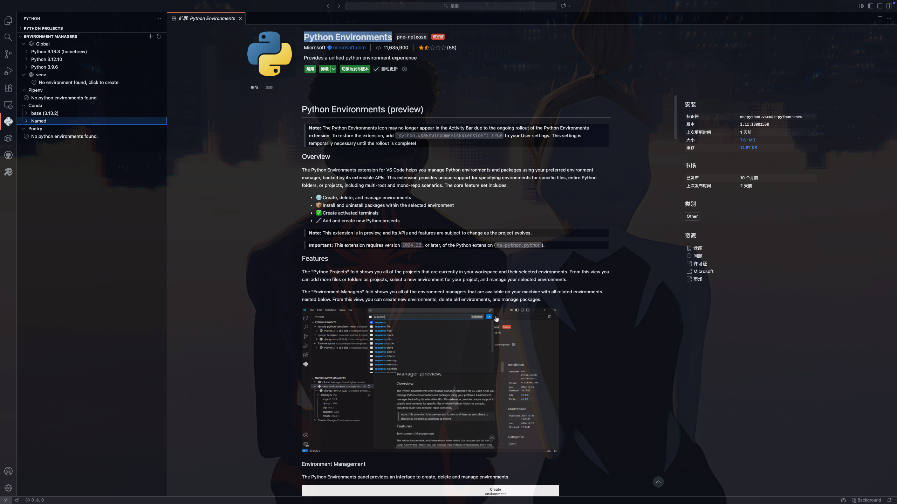

## 前情

### Python Environments

vscode 安装了一个插件叫`Python Environments`可以看到电脑整个 python 的环境，发现我全局系统下有三个 python，就好奇到底是哪三个

> 1. Using Python 3.13.3 environment at: /usr/local/opt/python@3.13/Frameworks/Python.framework/Versions/3.13  （/usr/local/bin/python3.13）（brew）
> 2. Using Python 3.12.10 environment at: /Library/Frameworks/Python.framework/Versions/3.12  （/usr/local/bin/python3.12）
> 3. Using Python 3.9.6 environment at: /Library/Developer/CommandLineTools/Library/Frameworks/Python3.framework/Versions/3.9 （/usr/bin/python3）

brew是我自己安装的，2、3 应该是 mac 自带的

#### 插件扫描范围

| Environment Manager | Find Environments | Create | Quick Create |
| :------------------ | :---------------- | :----- | :----------- |
| venv                | ✅                 | ✅      | ✅            |
| conda               | ✅                 | ✅      | ✅            |
| pyenv               | ✅                 |        |              |
| poetry              | ✅                 |        |              |
| system              | ✅                 |        |              |
| pipenv              | ✅                 |        |              |



### 起因

然后我用 brew 安装的 python3.13 去安装工具的时候报错如下：

```shell
jay:bin $ pip3.13 install cowsay
error: externally-managed-environment

× This environment is externally managed
╰─> To install Python packages system-wide, try brew install
    xyz, where xyz is the package you are trying to
    install.
    
    If you wish to install a Python library that isn't in Homebrew,
    use a virtual environment:
    
    python3 -m venv path/to/venv
    source path/to/venv/bin/activate
    python3 -m pip install xyz
    
    If you wish to install a Python application that isn't in Homebrew,
    it may be easiest to use 'pipx install xyz', which will manage a
    virtual environment for you. You can install pipx with
    
    brew install pipx
    
    You may restore the old behavior of pip by passing
    the '--break-system-packages' flag to pip, or by adding
    'break-system-packages = true' to your pip.conf file. The latter
    will permanently disable this error.
    
    If you disable this error, we STRONGLY recommend that you additionally
    pass the '--user' flag to pip, or set 'user = true' in your pip.conf
    file. Failure to do this can result in a broken Homebrew installation.
    
    Read more about this behavior here: <https://peps.python.org/pep-0668/>

note: If you believe this is a mistake, please contact your Python installation or OS distribution provider. You can override this, at the risk of breaking your Python installation or OS, by passing --break-system-packages.
hint: See PEP 668 for the detailed specification.
```

也就是说防止破坏系统依赖，需要通过`brew install xxx`安装，如果brew 没有收录进来，要么创建虚拟环境，要么安装 pipx 通过 pipx install xxx

其实 pipx 就是帮忙创建了虚拟环境这些

## venv

自 Python 3.3 后就自带了

### 使用方式

```shell
# pip3 -m venv <dir_name>
pip3 -m venv venv
source venv/bin/activate
pip install -r requirements.txt
deactivate

pip3 -m venv .venv
source .venv/bin/activate
pip install -r requirements.txt
deactivate
```

#### 操作你🫵啊

这里可以变成 pipx 的玩法，PyCharm 就是这么玩的

在 PyCharm 中如果你没有安装 pipenv 这些，他可以帮你安装，其实就是通过系统里面的 python 去创建 venv 

PyCharm 就是通过 venv 安装的pipenv、hatch等

比如 hatch 的安装他创建目录后生成 venv 然后在虚拟环境里面安装 hatch 最后软连接到 `/Users/li/.local/bin`目录去使用

```
jay:bin $ find ~ -iname "hatch" 2>/dev/null
/Users/li/.local/bin/hatch
/Users/li/Library/Application Support/hatch
/Users/li/Library/Application Support/hatch/venv/bin/hatch
/Users/li/Library/Application Support/hatch/venv/lib/python3.13/site-packages/hatch
```

通过 python 写的包都可以通过这种方式安装

```
jay:bin $ cd ~/.local/bin 
jay:bin $ ll
total 80104
lrwxr-xr-x@ 1 li  staff    57B 10 30 12:03 cookiecutter -> /Users/li/.local/pipx/venvs/cookiecutter/bin/cookiecutter
lrwxr-xr-x@ 1 li  staff    58B  9 22 10:07 hatch -> /Users/li/Library/Application Support/hatch/venv/bin/hatch
lrwxr-xr-x@ 1 li  staff    60B  9 22 10:08 pipenv -> /Users/li/Library/Application Support/pipenv/venv/bin/pipenv
lrwxr-xr-x@ 1 li  staff    45B  9 22 09:37 poetry -> /Users/li/.local/pipx/venvs/poetry/bin/poetry
```

## Virtualenv

安装了 pycharm 就自带 virtualenv，我在终端敲并没有安装

免安装使用

```shell
python virtualenv.pyz --help
```

我全局查找这个文件也没找到

不知道pycharm是怎么实现的

## Pipenv

pipenv

## Poetry

时间过太久了应该是这么安装的

```shell
brew install python@3.13
brew install pipx
pipx install poetry
```

## Hatch

Hatch

## Conda

conda

## uv

rust 写的

