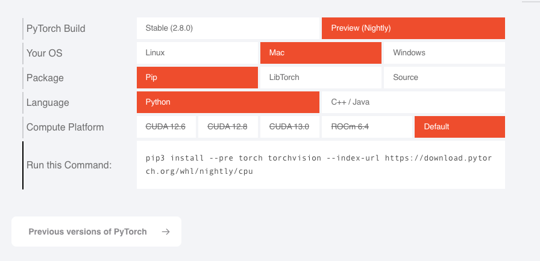

### 命令

```shell
conda create -n pytorch python=3.12.11
conda activate pytorch
# https://pytorch.org/
# 按图片这样选
pip3 install --pre torch torchvision --index-url https://download.pytorch.org/whl/nightly/cpu
```



### 测试

```python
import torch

print(torch.__version__)
print(torch.device("mps"))

# 2.10.0.dev20250923
# mps
```

