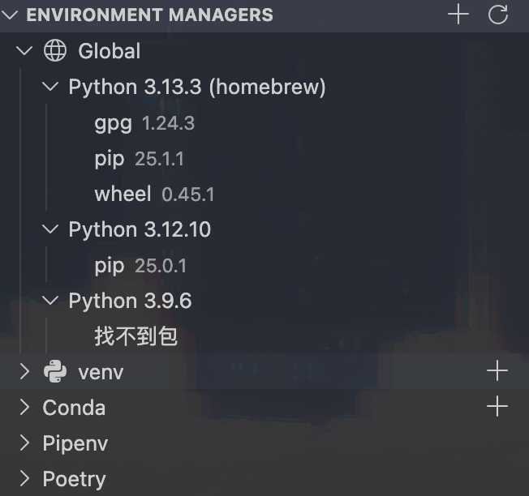

## 前情

vscode 的插件可以看到 Mac 电脑整体的 Python 环境安装情况。



一开始是相当懵逼的，哪里来这么多环境的。

网上看到了一篇知乎：https://www.zhihu.com/question/420273182 

讲的蛮清楚的

大概讲一下我这个情况吧

Python3.13 是我用 brew 安装的

python3.12 和 python3.9.6 则是 Mac 自带的

conda 是我自己安装的

poetry 和 pipenv 则是 pycharm 通过 pip3 -m venv xxx 安装的

## 方式

我直接把 brew 安装的 python 放到 path 最前面了，这样默认的 python 用的就是 brew 安装的。但是你不能通过 `pip install xxx`，因为 brew 会防止破坏系统依赖，需要通过`brew install xxx`安装，如果brew 没有收录进来，要么创建虚拟环境，要么安装 pipx 通过 pipx install xxx。

```shell
# 查看安装位置
brew info python

# 我的安装位置是
/usr/local/opt/python@3.13/libexec/bin

vim ~/.zshrc

# 填进去就行
export PATH=/usr/local/opt/python@3.13/libexec/bin:$PATH
```


